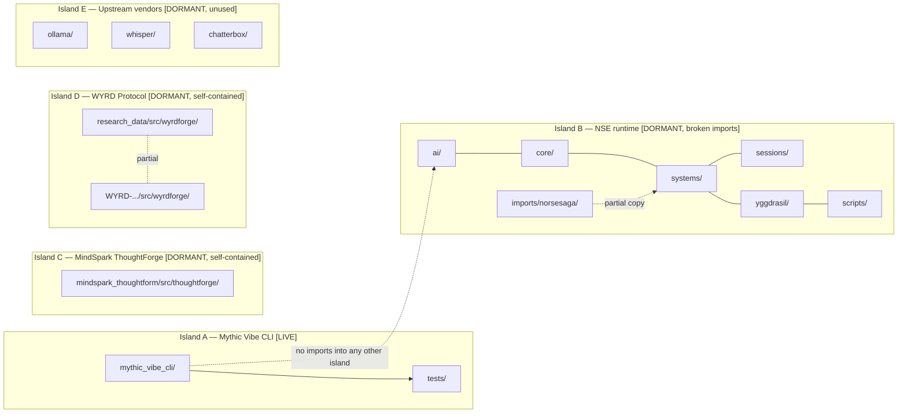
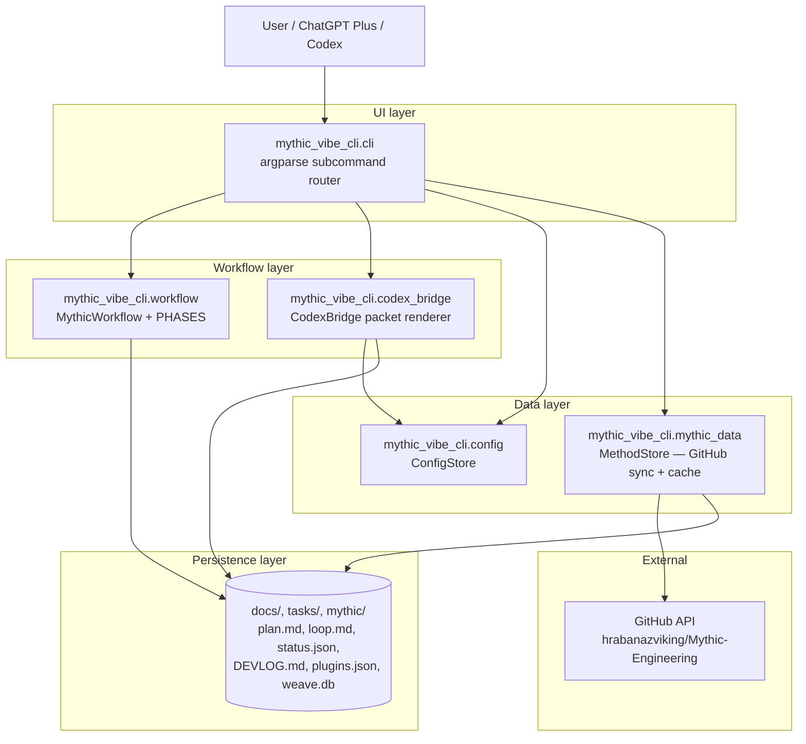
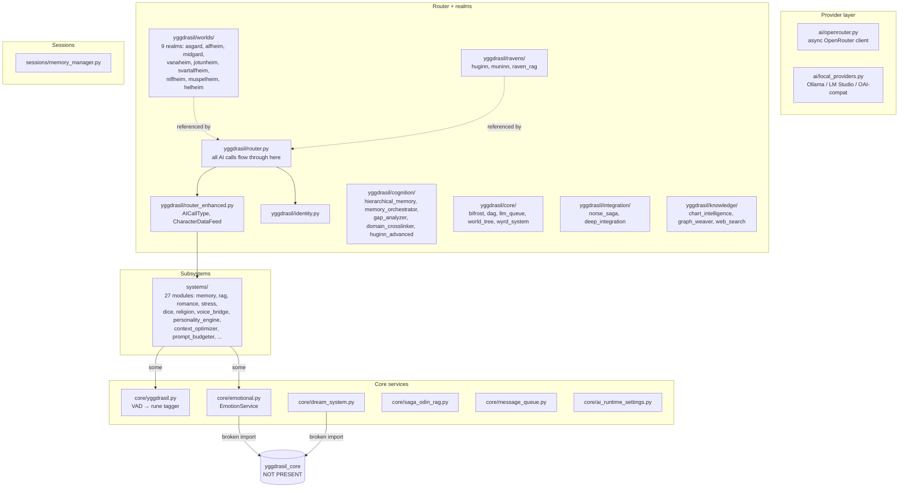
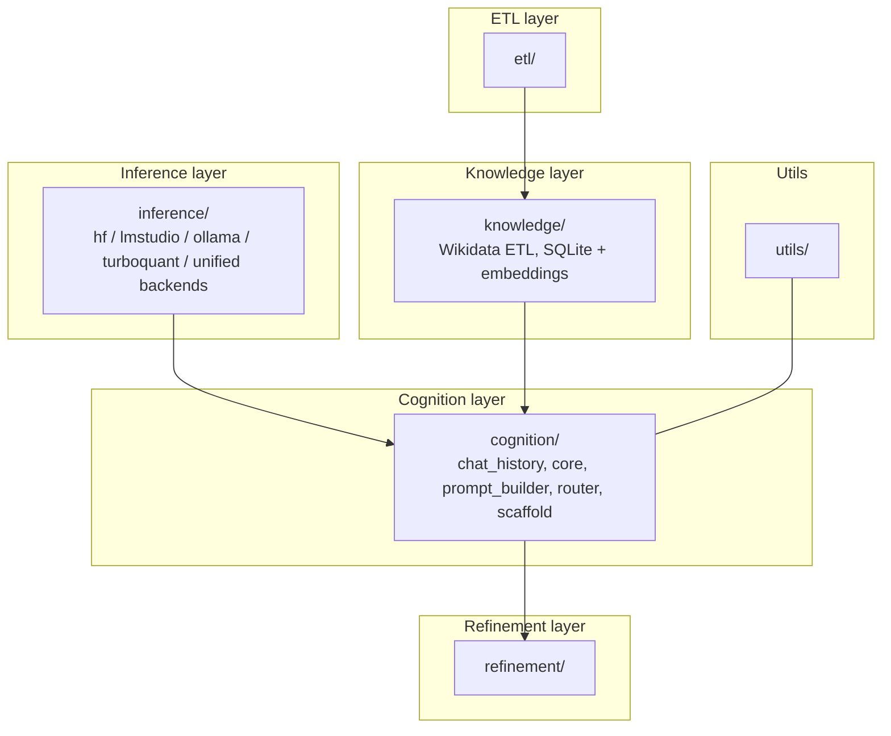
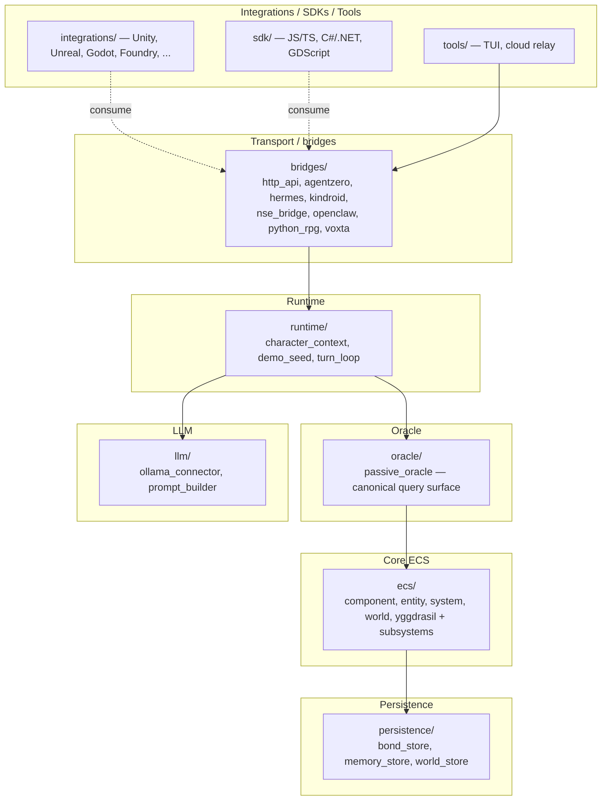
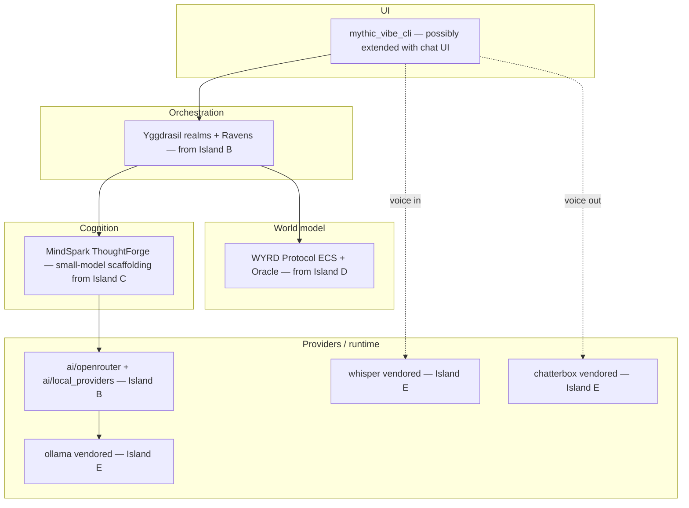

# ARCHITECTURE.md — Layered Decomposition

**Last updated:** 2026-04-23
**Author:** Védis Eikleið (Cartographer)
**Scope:** Subsystem stack and layer ownership inside `Viking-Code-Mythic-Engineering-CLI-Vibe-Coding`, branch `development`.
**Companion scrolls:** `MAP.md` (directory map), `DEPENDENCIES.md` (concrete edges), `DATA_FLOW.md` (state movement).

## Symbol legend

- **Layer** — conceptual stack level (UI → domain → integrations → persistence → transport).
- **Island** — a connected graph of code that shares imports but does not reach other islands.
- **Seam** — where two islands could connect but currently do not.
- `[LIVE]` — currently executable path.
- `[DORMANT]` — present but not wired to anything in this repo.

---

## 1. The five islands, at a glance

This repo is not one system. It is **five islands** sharing a root directory.



Only Island A has a working end-to-end path in the current state of the repo. Everything else is dormant — present as source, unreferenced by the declared product.

---

## 2. Layered view of Island A — Mythic Vibe CLI (the product)

This is the only island whose layering is load-bearing right now.



**Layer ownership, Island A:**

| Layer | Owner | Responsibility |
|---|---|---|
| UI | `cli.py` | Parse argv, dispatch to `cmd_*` functions, print results. |
| Workflow | `workflow.py` | Maintain seven-phase state (`intent → constraints → architecture → plan → build → verify → reflect`); write templates; append DEVLOG; run doctor checks. |
| Bridge | `codex_bridge.py` | Render Codex prompt packets; apply excerpt limits + auto-compaction according to config. |
| Config | `config.py` | Layered config resolution: `~/.mythic-vibe.json` → `$XDG_CONFIG_HOME/mythic-vibe/config.json` → `<project>/.mythic-vibe.json`, env vars override. |
| Method sync | `mythic_data.py` | Pull Mythic Engineering `.md` corpus from GitHub; local cache. |
| Persistence | filesystem | JSON state, Markdown logs, optional SQLite via `mythic db migrate`. |

**Commands implemented:** `init/start/imbue`, `checkin`, `status`, `import-md`, `codex-pack/evoke`, `codex-log`, `sync`, `method`, `doctor/scry`, `weave`, `prune`, `heal`, `oath`, `grimoire add|list`, `config`, `config set`, `db migrate`, `plunder`.

---

## 3. Layered view of Island B — NSE runtime (dormant, at repo root)

The root-level `ai/`, `core/`, `systems/`, `sessions/`, `yggdrasil/` reproduce the Norse Saga Engine's layer shape, but are disconnected from the CLI and have unresolved imports.



**Observed break:** `core/emotional.py` and `core/dream_system.py` import `yggdrasil_core` — a package that is **not present** anywhere in this repo (the closest thing is `yggdrasil/core/`, a different name). Island B will not import cleanly as-is.

**Docstring mention:** multiple NSE files reference being v4–v8 of the Norse Saga Engine. The `config.yaml` at repo root is headered "Norse Saga Engine Configuration v8.0.0". These files were extracted from NSE but not rewired.

---

## 4. Layered view of Island C — MindSpark ThoughtForge

Self-contained. Its own `pyproject.toml`, `requirements.txt`, `Dockerfile`, `tests/`, `scripts/`.



Status: the project is labelled v1.0.0 / Production-Stable in its own `pyproject.toml`. Inside this repo it is **not installed, not imported by anything outside its own tree**.

There is also a redundant empty shell at `mindspark_thoughtform/MindSpark_ThoughtForge/` (only PHILOSOPHY/README/RULES) — see `MAP.md` H-5.

---

## 5. Layered view of Island D — WYRD Protocol

Largest self-contained island. Own CLAUDE.md, own TASK_*.md phase files (Phase 11d..19), own tests, own integrations.



Status: v1.0.0 RELEASED per its own docs. Complete. Unused from inside this repo.

Duplicate-in-miniature: `research_data/src/wyrdforge/` contains only `models`, `runtime`, `schemas`, `security`, `services` — a subset. Divergence risk (H-3).

---

## 6. Layered view of Island E — Upstream vendors

```
ollama/        Go module  — full ollama/ollama clone (api, server, runner, model, llm, llama, ml, ...)
whisper/       Python pkg — openai/whisper (audio, decoding, model, tokenizer, transcribe, ...)
chatterbox/    Python pkg — Resemble AI Chatterbox (tts, tts_turbo, vc, mtl_tts, gradio apps)
```

Each carries its own `LICENSE`, `pyproject.toml` or `go.mod`, test suite, and example scripts. None is imported or called by code elsewhere in this repo.

They are provisions on the deck — not yet rigged to the mast.

---

## 7. Layer reconciliation — what the intended shape might be

If one overlays the islands, a coherent future stack emerges. **This is not the current state**; it is the terrain a future `TASK_integration.md` will have to bridge.



**Currently missing seams (none of these edges exist in code):**

| Seam | From | To | What it would require |
|---|---|---|---|
| S-1 | `mythic_vibe_cli` | `yggdrasil.router` | CLI subcommand or import bridge; resolve the `yggdrasil_core` ghost import first. |
| S-2 | `yggdrasil.integration.norse_saga` | MindSpark `thoughtforge.cognition` | Define call contract; MindSpark is currently un-installed. |
| S-3 | `yggdrasil.router_enhanced` | WYRD `passive_oracle` | WYRD bridges expect HTTP (`http_api.py`) — would need an adapter or in-process binding. |
| S-4 | CLI | ollama | CLI has no provider layer; ollama is only a Go daemon here. Needs a Python client call-site. |
| S-5 | `ai.local_providers` | ollama | Already compatible (Ollama port 11434) — but `ai/local_providers.py` is not imported by the CLI. |

---

## 8. Architectural verdict (structural, not prescriptive)

- **One working product layer (Island A)** floating in a **library-of-corpora** of five disconnected sub-systems.
- The CLI ships a tight 6-file package; everything else is optional cargo.
- Before any layer-wide decision, the `yggdrasil_core` ghost (H-1), the wyrdforge triplication (H-3), and the empty MindSpark shell (H-5) should be resolved so subsequent layers can be reasoned about without false-positive coupling.

Continue to `DEPENDENCIES.md` for the concrete import edges and external-package list, and `DATA_FLOW.md` for how state actually moves through Island A today.
