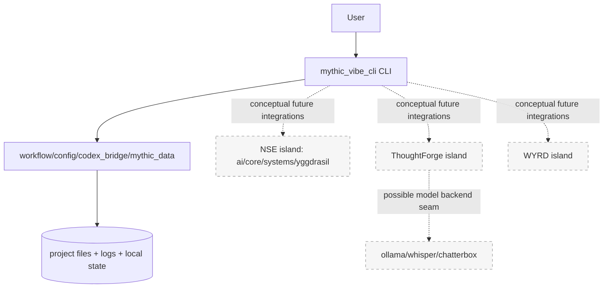

# CARTOGRAPHER_INTEGRATION_ROUTES.md

**Author:** Védis Eikleið, Cartographer (The Sensual Wayfinder)  
**Date:** 2026-04-23  
**Intent:** Detailed route map showing how to move from the current state to a coherent planned project while preserving orientation and minimizing breakage.

---

## 1) Present-state route graph

Interpretation: the user-visible path is clear and narrow; the latent capabilities are broad and disconnected.

---

## 2) Detailed route options for planned project

## Route 1 — CLI + ThoughtForge (cognition-first)

**Goal:** Keep current CLI UX and add robust local cognition/inference capabilities.

### Sequence

1. Introduce a small adapter package inside `mythic_vibe_cli` that can call one selected `thoughtforge` capability.
2. Keep the adapter boundary explicit (`adapters/thoughtforge_adapter.py`).
3. Add command(s) behind feature flag in config.
4. Add integration tests that fail closed when ThoughtForge deps unavailable.

### Benefits

- Reuses existing CLI operational shell.
- Lower semantic mismatch than full world-model merge.

### Risks

- Dependency drift between root env and subproject env.
- Ambiguous ownership if direct deep imports proliferate.

---

## Route 2 — CLI + WYRD (world-model-first)

**Goal:** Add persistent world/state orchestration as first-class system.

### Sequence

1. Select canonical `wyrdforge` source (full project directory, not partial mirrors).
2. Freeze interfaces needed by CLI (e.g., session init, turn execution, state query).
3. Implement a thin bridge command set in CLI.
4. Add state snapshot and consistency tests.

### Benefits

- Unlocks durable simulated-state backbone.
- Strong fit for narrative/systemic project ambitions.

### Risks

- Duplicate `wyrdforge` code trees increase wrong-import risk.
- Requires strict package and path governance before adoption.

---

## Route 3 — CLI + NSE island (legacy salvage)

**Goal:** Revive transplanted NSE modules already at root.

### Sequence

1. Resolve missing imports and module-root assumptions.
2. Convert implicit root imports into stable package layout.
3. Build a single end-to-end smoke pipeline.
4. Retire or quarantine unneeded modules.

### Benefits

- Leverages existing rich architecture within current root tree.

### Risks

- Highest uncertainty due to known import fragility.
- Large sidecar/doc overhead may obscure execution reality.

---

## 3) Cartographer-recommended integration order

1. **Stabilize source-of-truth boundaries** (what is live vs archival vs candidate).  
2. **Choose exactly one deep integration route first** (ThoughtForge or WYRD).  
3. **Create seam contracts + tests before broad import wiring.**  
4. **Update map pack at each milestone.**

This order preserves orientation and avoids tangled hybrid states.

---

## 4) Required governance artifacts for safe scaling

- `INTEGRATION_CONTRACTS.md` — declared seam APIs, ownership, and invariants.
- `RUNTIME_BOUNDARIES.md` — what is allowed to import what.
- `DUPLICATION_POLICY.md` — canonical source + mirror handling rules.
- `ENVIRONMENT_MATRIX.md` — per-island dependency/runtime constraints.

---

## 5) Drift and blast-radius checkpoints

Before each structural merge, run a checkpoint ritual:

1. Recompute top-level inventory counts.
2. Re-scan for duplicate package names/paths.
3. Validate packaging entrypoints still point to intended product.
4. Execute relevant tests for touched island + CLI regression set.
5. Update map/docs in same PR as code changes.

---

## 6) “Always callable” Cartographer operational note

This repository now includes a reusable skill definition at:

- `skills/cartographer-the-sensual-wayfinder/SKILL.md`
- `skills/cartographer-the-sensual-wayfinder/agents/openai.yaml`
- `skills/cartographer-the-sensual-wayfinder/references/document-pack-template.md`

Use those files to re-invoke this persona/workflow consistently in future tasks and in other repos (by copying/installing the skill folder into the active Codex skills directory).

