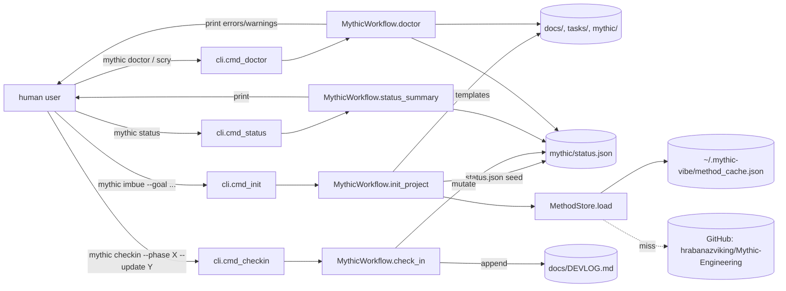
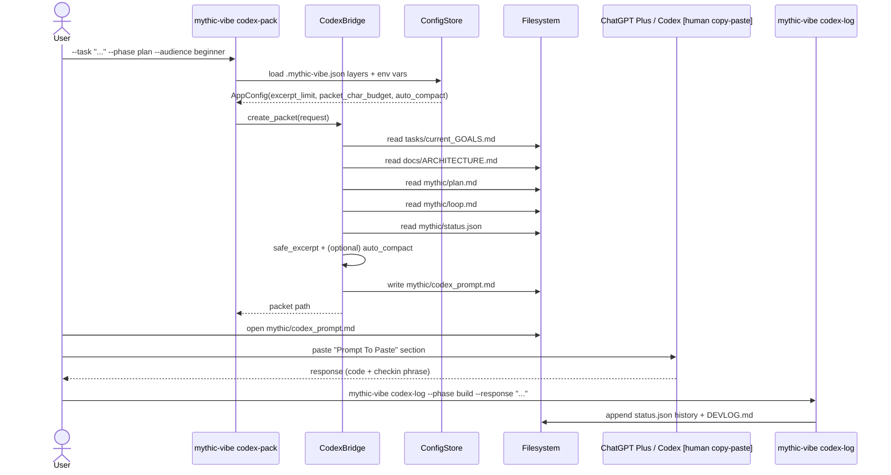
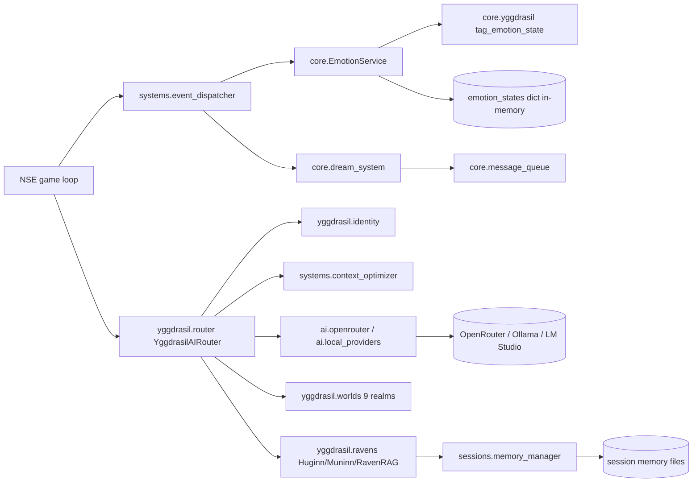

# DATA_FLOW.md — How Data and State Move

**Last updated:** 2026-04-23
**Author:** Védis Eikleið (Cartographer)
**Scope:** State locations, transformations, and movement paths in `Viking-Code-Mythic-Engineering-CLI-Vibe-Coding` as it stands on branch `development` today.
**Companion scrolls:** `MAP.md`, `ARCHITECTURE.md`, `DEPENDENCIES.md`.

## Symbol legend

- `[in-memory]` — state held only in a running Python process.
- `[disk]` — persisted file / SQLite database.
- `[net]` — network fetch.
- `[human]` — state crosses a human (copy/paste loop).
- `◆` — the flow is currently live in the repo.
- `◇` — the flow is documented / intended but not wired up.

---

## 1. What actually flows today — Island A (Mythic Vibe CLI)

Only Island A has an end-to-end live flow. Everything else is dormant data at rest.

### 1.1 The seven-phase state cycle  ◆



**State locations for Island A:**

| Store | Kind | Written by | Read by | Shape |
|---|---|---|---|---|
| `mythic/status.json` | [disk] JSON | `init`, `checkin`, `codex-log`, `weave` | `status`, `doctor`, `codex-pack` | `{goal, current_phase, completed_phases[], last_update, history[{time,phase,update}]}` |
| `docs/DEVLOG.md` | [disk] Markdown append-only | `checkin`, `codex-log`, `weave` | human | Chronological bullet entries |
| `docs/{PHILOSOPHY,ARCHITECTURE,DOMAIN_MAP,DATA_FLOW,DEVLOG}.md` | [disk] Markdown templates | `init` (once) | human + `codex-pack` excerpts | Template markdown |
| `mythic/{plan,loop}.md` | [disk] Markdown | `init` | human + `codex-pack` excerpts | Template markdown |
| `MYTHIC_ENGINEERING.md`, `SYSTEM_VISION.md`, `tasks/current_GOALS.md` | [disk] Markdown | `init` | human + `codex-pack` excerpts | Template markdown |
| `~/.mythic-vibe/method_cache.json` | [disk] JSON | `sync`, `method` (lazy) | `method`, `init` | `{source, content}` — README.md content from GitHub |
| `mythic/plugins.json` | [disk] JSON | `grimoire add` | `grimoire list` | `{plugins: [entrypoint strings]}` |
| `mythic/config.toml` | [disk] TOML | `config set` | none yet (reference only) | Free-form dotted keys |
| `mythic/weave.db` | [disk] SQLite | `db migrate` | none yet | Empty `rituals` table |
| `mythic/codex_prompt.md` | [disk] Markdown | `codex-pack`, `evoke` | **human (copy/paste to ChatGPT)** | Prompt packet |

### 1.2 The Codex copy/paste loop  ◆

This is the load-bearing loop of the whole product. Data crosses a human twice.



**Transformations:**

1. **Read-in** — 4 Markdown files + 1 JSON read verbatim.
2. **Trim** — `CodexBridge._safe_excerpt` truncates each to `excerpt_limit` chars, appending `... [truncated by mythic-vibe]` on overflow.
3. **Budget-compact** — if total chars exceed `packet_char_budget`, `_compact_sections` re-truncates each section to an equal share (min 200 chars).
4. **Render** — `_render_packet` wraps the four excerpts + status JSON into a Markdown prompt with a fixed "Prompt To Paste" header and a fixed output contract (`Mythic Plan Update` / `File Changes` / `Verification` / `Checkin`).
5. **Emit** — written to `mythic/codex_prompt.md` (or `--out`).
6. **Human crossing** — user copies section to ChatGPT, receives a response.
7. **Log back** — user runs `codex-log`, appending to `status.json.history` and `docs/DEVLOG.md`.

### 1.3 Config precedence (low → high)  ◆

```
default AppConfig(excerpt_limit=1800, packet_char_budget=12000, auto_compact=True)
  ↓ overridden by
~/.mythic-vibe.json                (codex.excerpt_limit, codex.packet_char_budget, codex.auto_compact)
  ↓ overridden by
$XDG_CONFIG_HOME/mythic-vibe/config.json
  ↓ overridden by
<project>/.mythic-vibe.json
  ↓ overridden by
env vars: MYTHIC_EXCERPT_LIMIT, MYTHIC_PACKET_CHAR_BUDGET, MYTHIC_AUTO_COMPACT
```

Merging is a shallow deep-merge (`_deep_merge`) at the dict layer; ints are range-clamped; bools parse `1/0/true/false/yes/no/on/off`.

### 1.4 Method-notes sync  ◆

```
mythic sync:
  GET https://raw.githubusercontent.com/hrabanazviking/Mythic-Engineering/main/README.md
  → write ~/.mythic-vibe/method_cache.json

mythic method:
  load() → if cache exists, return; else sync(); on URLError → DEFAULT_METHOD_NOTES literal

mythic import-md:
  GET https://api.github.com/repos/hrabanazviking/Mythic-Engineering/git/trees/main?recursive=1
  → for each .md blob: GET raw.githubusercontent.com/.../<path> → write to <project>/docs/mythic_source/<path>
  → write _import_index.json summary
```

### 1.5 Plunder (one-file GitHub copy)  ◆

```
mythic plunder --repo owner/name --source path --dest local --ref main --token-env GITHUB_TOKEN
  ↓ base64-decode content from GitHub contents API
  ↓ write to <dest>
```

Auth is via `GITHUB_TOKEN` env var; no token is stored.

---

## 2. What does NOT flow today — dormant state

### 2.1 Island B — NSE at root  ◇

`diagnostics/turn_trace.jsonl` is present as a data artifact but nothing in the repo writes it right now because:

- `core/emotional.py` and `core/dream_system.py` fail to import (`yggdrasil_core` missing — see `ARCHITECTURE.md` break note).
- `debug_router_integration.py` would import `yggdrasil.*` — that sub-package imports cleanly itself (`yggdrasil/__init__.py` → `core/`, `ravens/`, `worlds/`), but `yggdrasil.router` then imports `systems.context_optimizer`, which would succeed only if the repo root is on `sys.path`.
- `systems/` lacks the `event_dispatcher.py` that `core/emotional.py` references — the only `event_dispatcher.py` lives at `imports/norsesaga/systems/event_dispatcher.py`. Islands cross streams here.

**Intended data flow (per NSE docstrings):**



Observed shapes:

- `EmotionService` keeps `emotion_states: Dict[character_id, Dict[valence,arousal,dominance,...]]` and `emotion_runes: Dict[character_id, rune_name]` in process memory; a VAD→rune cache shortcuts repeated queries.
- `core/yggdrasil.py` maps VAD vector → nearest Elder Futhark rune via centroid Euclidean distance over 24 hardcoded centroids.
- `ai/openrouter.py` keeps an async `httpx` client; `ai/local_providers.py` has jittered backoff + health checks for Ollama/LM Studio/OAI-compatible backends.

### 2.2 Island C — MindSpark  ◇

Self-contained intended flow (per its own docs and directory shape):

```
Wikidata .json dump
  → thoughtforge.etl (subset, schema, embeddings)
  → SQLite knowledge DB + embedding vectors
  → thoughtforge.knowledge (forge, lifecycle, store)
  → thoughtforge.cognition (scaffold, prompt_builder, router, core, chat_history)
  → thoughtforge.inference backends (hf / lmstudio / ollama / turboquant)
  → thoughtforge.refinement (fragment salvage)
  → final response
```

Not wired to anything in this repo outside its own tree.

### 2.3 Island D — WYRD  ◇

Self-contained intended flow (from its `CLAUDE.md`):

```
LLM agent / external engine (Unity/Unreal/Godot/Foundry/OpenSim/...)
  ↓ HTTP request
wyrdforge.bridges.http_api WyrdHTTPServer
  ↓
wyrdforge.runtime.turn_loop
  ↓
wyrdforge.oracle.passive_oracle (9 query types)
  ↓ reads
wyrdforge.ecs.world (entities, components)
wyrdforge.ecs.yggdrasil (spatial hierarchy)
wyrdforge.persistence.{memory_store, bond_store, world_store} (SQLite + FTS5)
  ↓
wyrdforge.llm.{ollama_connector, prompt_builder}
  ↓
response to external engine
```

Data at rest in this repo: none (no prebuilt DBs visible).

### 2.4 Island E — Upstream vendors  ◇

`ollama/` has its own complete runtime data flow (model store, manifests, blobs, server routes) but zero edges in or out of this repo.
`whisper/` and `chatterbox/` are inference-only libraries with no repo-side invocation.

---

## 3. Data corpora sitting at rest in the root

These are inputs with no reader in this repo yet.

| Artifact | Size | Shape | Expected reader |
|---|---|---|---|
| `arxiv_results.json` | 44 KB | arXiv paper objects | `scripts/parse_arxiv_and_generate.py` ✔ (actively reads) |
| `arxiv_all_papers.json` | 77 KB | arXiv paper objects | unreferenced |
| `arxiv_papers.json` | 9 KB | arXiv paper objects | unreferenced |
| `relevant_papers.json` | 67 KB | arXiv paper objects | unreferenced |
| `CHARACTER_TEMPLATE_SCHEM.yaml` | 177 KB | NSE character schema | unreferenced in this repo |
| `config.yaml` | 35 KB | NSE v8.0.0 config — OpenRouter models list | unreferenced in this repo |
| `diagnostics/turn_trace.jsonl` | — | NSE turn trace events | unreferenced — dormant log |

`scripts/parse_arxiv_and_generate.py` is the only script that consumes any of these: it loads `arxiv_results.json`, adds repo root to `sys.path`, calls `OpenRouterClient` from `ai/openrouter.py` with `$OPENROUTER_API_KEY`, and writes a generated report.

---

## 4. State ownership matrix (aggregate)

| Store | Owner | Lifetime | Resets on |
|---|---|---|---|
| `mythic/status.json` | Island A | per-project | `mythic init` (if missing) |
| `docs/DEVLOG.md` | Island A | per-project | append-only |
| `~/.mythic-vibe/method_cache.json` | Island A | per-user | `mythic sync` |
| `mythic/weave.db` | Island A | per-project | `db migrate` (idempotent) |
| `mythic/plugins.json` | Island A | per-project | add-only |
| Env vars `MYTHIC_*` | Island A | per-shell | shell close |
| `EmotionService.emotion_states` | Island B (process) | per-run | process restart |
| `_vad_rune_cache` | Island B (process) | per-run | process restart |
| `method_cache` on disk (mindspark/wyrd/whisper/chatterbox) | their own subproject | each subproject owns its own state | — |

---

## 5. Summary of what moves vs. what sleeps

**Moves today:**

- Seven-phase workflow state (status.json ↔ DEVLOG ↔ CLI ↔ human).
- Codex packet loop (disk → human → ChatGPT → human → disk).
- Method notes sync (GitHub → local cache).
- Mythic corpus import (GitHub tree → local folder).
- Plunder single-file copy (GitHub → local).
- `scripts/parse_arxiv_and_generate.py`: arXiv JSON → OpenRouter → generated report.

**Sleeps:**

- All NSE runtime flows (Island B) — blocked by `yggdrasil_core` absence.
- All MindSpark runtime flows (Island C) — never invoked.
- All WYRD runtime flows (Island D) — never invoked.
- All vendored Ollama/whisper/chatterbox flows (Island E) — never invoked.
- The 4 arXiv JSON dumps, the 177 KB character schema, the 35 KB NSE config — unread.

The CLI is a quiet, deterministic stream. Everything else is a lake waiting for a channel cut to it.
