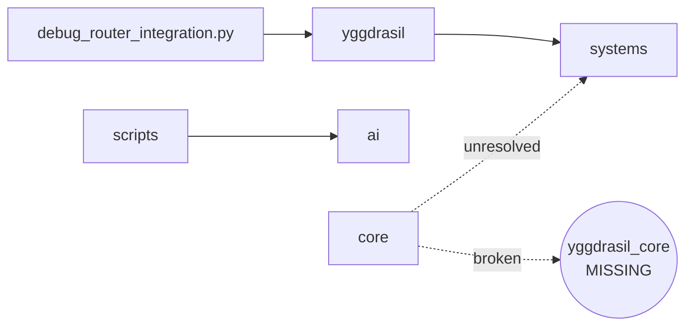

# DEPENDENCIES.md — Internal Edges + External Packages

**Last updated:** 2026-04-23
**Author:** Védis Eikleið (Cartographer)
**Scope:** Actual import edges between directories, and declared external dependencies per sub-project manifest.
**Companion scrolls:** `MAP.md` (top-level map), `ARCHITECTURE.md` (layers), `DATA_FLOW.md` (state movement).

## Symbol legend

- `A → B` — A imports from B (verified by grep).
- `A ⇢ B` — A is documented-as-depending-on B but no code import exists.
- `A ✗→ B` — A imports B but B does not exist in this repo (broken edge).
- `[int]` — internal edge (inside this repo).
- `[ext]` — external package (PyPI, Go module, npm).

---

## 1. Internal edges — island by island

### 1.1 Island A — Mythic Vibe CLI

Verified by reading all six files in `mythic_vibe_cli/`.

```
mythic_vibe_cli/
├── __init__.py
├── cli.py          → codex_bridge, config, mythic_data, workflow
├── codex_bridge.py → config
├── config.py       (leaf — stdlib only)
├── mythic_data.py  (leaf — stdlib only; opens urllib to github.com)
└── workflow.py     (leaf — stdlib only)
```

Tests:

```
tests/test_cli.py               → mythic_vibe_cli.cli
tests/test_config_and_bridge.py → mythic_vibe_cli.codex_bridge, mythic_vibe_cli.config
tests/test_workflow.py          → (presumed) mythic_vibe_cli.workflow
```

**Nothing in Island A imports anything from any other island in this repo.**

---

### 1.2 Island B — NSE at repo root (ai/, core/, systems/, sessions/, yggdrasil/, scripts/)

Verified edges:

| From | Imports | To | Status |
|---|---|---|---|
| `yggdrasil/__init__.py` | world_tree, dag, bifrost, llm_queue | `yggdrasil/core/*` | [int] ok |
| `yggdrasil/__init__.py` | huginn, muninn, raven_rag | `yggdrasil/ravens/*` | [int] ok |
| `yggdrasil/__init__.py` | Asgard..Helheim (9) | `yggdrasil/worlds/*` | [int] ok |
| `yggdrasil/enhanced_router.py` | YggdrasilAIRouter | `yggdrasil/router.py` | [int] ok |
| `yggdrasil/router.py` | AICallType, CharacterDataFeed, AICallContext | `yggdrasil/router_enhanced.py` | [int] ok |
| `yggdrasil/router.py` | ContextOptimizer | `systems/context_optimizer.py` | [int] ok — cross-directory |
| `yggdrasil/router.py` | validate_identity_isolation | `yggdrasil/identity.py` | [int] ok |
| `systems/housekeeping.py` | get_crash_reporter, ThorGuardian | `systems/crash_reporting`, `systems/thor_guardian` | [int] ok |
| `systems/stress_system.py` | StressAccumulator | `systems/emotional_engine` | [int] ok |
| `systems/thor_guardian.py` | get_crash_reporter | `systems/crash_reporting` | [int] ok |
| `systems/unified_memory_facade.py` | (multiple) | `systems/enhanced_memory`, `systems/character_memory_rag` | [int] `character_memory_rag` not found in listing — verify |
| `systems/emotional_engine.py` | (stdlib + `yaml`) | — | leaf |
| `core/yggdrasil.py` | numpy | — | leaf |
| `core/emotional.py` | `from yggdrasil_core import tree` | **`yggdrasil_core`** | **✗→ broken; module not present** |
| `core/emotional.py` | `from systems.event_dispatcher import EventType` | `systems/event_dispatcher` | [int] **not in listing** — see below |
| `core/dream_system.py` | `from ..yggdrasil_core import tree` | **`yggdrasil_core`** | **✗→ broken relative** |
| `core/saga_odin_rag.py` | (mentions yggdrasil_core in file) | — | likely same broken import |
| `ai/openrouter.py` | httpx (ext) | — | leaf |
| `ai/local_providers.py` | (stdlib + requests/httpx) | — | leaf |
| `sessions/memory_manager.py` | (stdlib) | — | leaf |
| `scripts/parse_arxiv_and_generate.py` | OpenRouterClient | `ai/openrouter.py` | [int] ok — adds repo root to `sys.path` at runtime |
| `debug_router_integration.py` | yggdrasil.router, yggdrasil.integration.norse_saga, yggdrasil.config, yggdrasil.ravens | `yggdrasil/*` | [int] smoke test |

**Additional unresolved references in Island B:**

- `systems/event_dispatcher` — imported by `core/emotional.py`, but `systems/` top-level listing does not show it (only `event_dispatcher.py` appears in `imports/norsesaga/systems/`, not in `systems/`). Possibly a name collision between the two copies (see H-4).
- `systems/character_memory_rag` — imported by `systems/unified_memory_facade.py` but not in the `systems/` directory listing.

**Cross-directory edges, Island B:**



---

### 1.3 Island C — MindSpark ThoughtForge

- 140 occurrences of `from thoughtforge` / `import thoughtforge` across 48 files, **all inside `mindspark_thoughtform/`**.
- Zero references from anywhere else in the repo.
- External dependencies declared in `mindspark_thoughtform/requirements.txt`:
  - Core: `sqlalchemy>=2.0`, `sentence-transformers>=2.7`, `ijson>=3.2`, `numpy>=1.26`, `tqdm>=4.66`, `pyyaml>=6.0`, `click>=8.1`, `rich>=13.0`, `platformdirs>=4.0`
  - Optional inference: `llama-cpp-python>=0.2.50`
  - Optional quantization: `bitsandbytes>=0.43`, `auto-gptq>=0.7`
  - Optional GPU (commented): `torch>=2.2`, `accelerate>=0.27`
  - Dev: `pytest>=8`, `pytest-cov>=5`, `ruff>=0.4`, `mypy>=1.9`, `locust>=2.24`
  - Docs: `mkdocs>=1.5`, `mkdocs-material>=9.5`, `mkdocstrings[python]>=0.24`

---

### 1.4 Island D — WYRD Protocol

- 324 occurrences of `from wyrdforge` / `import wyrdforge` across 81 files, **all inside `WYRD-.../`**. Sub-tree is internally consistent.
- Zero references from anywhere else in the repo.
- External dependencies declared in `WYRD-.../requirements.txt`:
  - Runtime: `pydantic>=2.0`, `pyyaml>=6.0`
  - Dev: `pytest>=7.0`, `pytest-asyncio>=0.23`, `ruff>=0.4`, `mypy>=1.9`
  - Commented optional: `sentence-transformers`, `sqlalchemy>=2.0`, `fastapi`, `uvicorn`, `click`

---

### 1.5 Island E — Upstream vendors

| Path | Manifest | External deps |
|---|---|---|
| `ollama/` | `go.mod` (Go 1.24.1) | `gin-gonic/gin v1.10.0`, `cobra v1.7.0`, `go-sqlite3 v1.14.24`, `uuid v1.6.0`, `testify v1.10.0`, `bubbletea v1.3.10`, `lipgloss v1.1.0`, `tree-sitter/go-tree-sitter v0.25.0`, `nlpodyssey/gopickle v0.3.0`, `pdevine/tensor`, `gonum.org/v1/gonum v0.15.0`, `golang.org/x/{sync,sys,image,mod,tools}`, `klauspost/compress`, many indirect. |
| `whisper/` | `requirements.txt` | `numba`, `numpy`, `torch`, `tqdm`, `more-itertools`, `tiktoken`, `triton>=2.0.0` (linux/x86_64 only) |
| `chatterbox/` | `pyproject.toml` | `numpy>=1.24,<1.26`, `librosa==0.11.0`, `s3tokenizer`, `torch==2.6.0`, `torchaudio==2.6.0`, `transformers==4.46.3`, `diffusers==0.29.0`, `resemble-perth==1.0.1`, `conformer==0.3.2`, `safetensors==0.5.3`, `spacy-pkuseg`, `pykakasi==2.3.0`, `gradio==5.44.1`, `pyloudnorm`, `omegaconf` |

None of these is imported by any non-upstream file in this repo.

---

### 1.6 Island boundary — research_data

- `research_data/src/wyrdforge/` uses `from wyrdforge.*` imports internally — a partial copy of the WYRD package (models/runtime/schemas/security/services). It is **not a sibling** of WYRD; it shares the package name `wyrdforge`, so if both are on `sys.path`, the later one wins and the earlier is shadowed.
- `research_data/` has its own `pyproject.toml` (declares `wyrdforge` v0.x, likely earlier snapshot).
- `research_data/tests/` has only 2 files (`test_memory_and_persona`, `test_micro_rag_and_truth`), each identical-or-near-identical to WYRD counterparts.

---

## 2. Repo-level external dependencies — what the CLI actually needs

`pyproject.toml` at repo root:

```toml
[project]
name = "mythic-vibe-cli"
version = "0.1.0"
requires-python = ">=3.10"
license = { text = "MIT" }
# no dependencies = []
```

**The root Mythic Vibe CLI declares zero third-party dependencies.** It uses only Python stdlib (`argparse`, `json`, `sqlite3`, `urllib`, `pathlib`, `dataclasses`, `textwrap`, `datetime`).

---

## 3. External-dependency matrix (aggregate)

Merged list from all manifests. A future integration task will need to decide which of these actually become repo-level deps.

### Python

| Package | Declared in | Purpose |
|---|---|---|
| sqlalchemy | mindspark | ORM over SQLite knowledge DB |
| sentence-transformers | mindspark | Embeddings |
| ijson | mindspark | Streaming Wikidata parser |
| numpy | mindspark, whisper, chatterbox, NSE (`core/yggdrasil.py`) | Arrays/embeddings |
| tqdm | mindspark, whisper | Progress bars |
| pyyaml | mindspark, WYRD, NSE (`systems/emotional_engine.py`) | YAML config |
| click | mindspark (optional WYRD) | CLI framework (ThoughtForge only) |
| rich | mindspark | Terminal output |
| platformdirs | mindspark | Cross-platform paths |
| llama-cpp-python | mindspark (opt) | Local LLM inference |
| bitsandbytes | mindspark (opt) | Quantization |
| auto-gptq | mindspark (opt) | Quantization |
| torch | mindspark (opt), whisper, chatterbox | ML runtime |
| torchaudio | chatterbox | Audio ML |
| transformers | chatterbox | HF models |
| diffusers | chatterbox | Diffusion models |
| librosa | chatterbox | Audio processing |
| s3tokenizer | chatterbox | Tokenizer |
| resemble-perth | chatterbox | Watermarking |
| conformer | chatterbox | Conformer arch |
| safetensors | chatterbox | Safe tensor format |
| spacy-pkuseg | chatterbox | Chinese tokenizer |
| pykakasi | chatterbox | Japanese romaji |
| gradio | chatterbox | Web UI |
| pyloudnorm | chatterbox | Loudness normalization |
| omegaconf | chatterbox | Config |
| pydantic | WYRD | Data validation |
| numba | whisper | JIT |
| tiktoken | whisper | OpenAI tokenizer |
| more-itertools | whisper | Iteration tools |
| triton | whisper (linux/x86_64) | GPU kernels |
| httpx | NSE `ai/openrouter.py` (imported, not declared at repo level) | HTTP client |
| pytest, pytest-asyncio, pytest-cov, ruff, mypy, locust | all dev | Test/lint |
| mkdocs, mkdocs-material, mkdocstrings[python] | mindspark docs | Doc site |

### Go (ollama only)

See `ollama/go.mod` — key direct deps: `gin`, `cobra`, `bubbletea`, `lipgloss`, `go-sqlite3`, `go-tree-sitter`, `go-tree-sitter-cpp`, `gopickle`, `tensor`, `gonum`, `compress`, `uuid`, `testify`.

### NPM (JS SDKs inside WYRD/integrations)

Not parsed here — WYRD `integrations/foundry/wyrdforge/` uses jest per its CLAUDE.md. A future sweep can catalogue `package.json` files.

---

## 4. Cross-reference table — duplications that could collide

| Name | Location A | Location B | Effect if both on path |
|---|---|---|---|
| `wyrdforge` | `WYRD-.../src/wyrdforge/` (full) | `research_data/src/wyrdforge/` (partial) | Later wins; partial shadows full or vice versa |
| `systems/*` | `systems/` (27 files, full) | `imports/norsesaga/systems/` (3 files) | The 3-file copy will shadow matching names if `imports/norsesaga/` is on path |
| `yggdrasil_core` | — (missing) | — (missing) | Any import of `yggdrasil_core` fails; see H-1 |
| `thoughtforge` | `mindspark_thoughtform/src/thoughtforge/` | `mindspark_thoughtform/MindSpark_ThoughtForge/` (empty shell) | Shell has no `thoughtforge` package — no collision, just confusion |

---

## 5. Docs-declared conceptual dependencies ⇢

From the root-level markdown corpus, conceptual (not code) dependencies:

- `ARCHITECTURE_STUDY_March-8-2026.md`, `Emotional_Engine_Integration_Plan_for_Norse_Saga_Engine.md`, `Fate-Weaver_Protocol_*.md` ⇢ NSE + WYRD + MindSpark merge story.
- `Building the Yggdrasil Cognitive Architecture in Python.md` ⇢ `yggdrasil/` package.
- `AI Viking TTRPG Emotional Engine Modeling Theory.md` (178 KB) ⇢ `systems/emotional_engine.py`, `core/emotional.py`.
- `Mythic_Engineering_CLI_Design_Ideas_*.md`, `Mystic_Engineering_Protocals1.0.md`, `Mythic_Engineers_Codex.md` ⇢ `mythic_vibe_cli/`.
- `WORLD_MODELING_SKILL.md`, `Technical_Architecture_of_Volmarrs_AI_Ecosystem.md` ⇢ WYRD + MindSpark + NSE ecosystem description.
- `CHARACTER_TEMPLATE_SCHEM.yaml` (177 KB) ⇢ character-data consumer yet to be identified (NSE/VGSK).

These are narrative-level couplings; no file here currently *reads* them as data.
