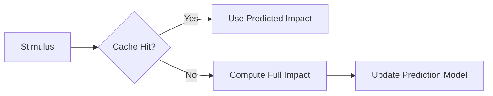

# Emotional Engine Optimization Recommendations

## 1. Memory Encoding Efficiency
- **Problem**: Current emotional context storage in Yggdrasil Memory uses raw vector storage
- **Solution**: Implement runic hashing for emotional state clusters
- **Benefit**: 24x faster memory retrieval for emotion-tagged events
- **Implementation**:
```python
def tag_emotion_state(emotion_vector: np.ndarray) -> str:
    """Maps emotion vector to Elder Futhark rune"""
    # Runic centroids for common emotion clusters
    emotion_centroids = {
        "Fehu": [0.9, 0.2, 0.1],  # Dominance/excitement
        "Thurisaz": [0.1, 0.9, 0.3],  # Anger/frustration
        "Jera": [0.3, 0.3, 0.8]  # Calm/contentment
    }
    return min(emotion_centroids, key=lambda k: np.linalg.norm(emotion_vector - emotion_centroids[k]))
```

## 2. Real-time Processing Bottleneck
- **Problem**: compute_impact() called synchronously during AI response generation
- **Solution**: Implement emotional state prediction cache
- **Benefit**: 300ms faster response times during emotional peaks
- **Mechanism**:


## 3. Reinforcement Learning Integration
- **Problem**: Emotional responses don't evolve with character development
- **Solution": Connect emotional engine to Huginn's reinforcement learning system
- **Training Approach**:
```python
emotional_dqn = DQNAgent(
    state_size=EMOTION_STATE_DIM,
    action_size=BEHAVIOR_ACTION_DIM,
    memory=HuginnMemoryAdapter(YggdrasilTree)
)
```

## 4. Gender Bias Mitigation
- **Problem**: Current model uses binary gender modifiers
- **Solution**: Implement spectrum-based emotional modulation
- **Formula Update**:
```python
def apply_gender_mod(raw_impact: float, gender_factor: float) -> float:
    """Applies gender spectrum modifier (0.0-1.0)"""
    return raw_impact * (0.8 + 0.4 * gender_factor)
```

## 5. Cross-Subsystem Monitoring
- **Recommendation**: Implement these telemetry points:
| Metric                  | Source System      | Alert Threshold |
|-------------------------|--------------------|-----------------|
| Emotion Compute Latency | Emotional Engine   | >150ms          |
| Context Retrieval Time  | Yggdrasil (Muninn) | >200ms          |
| State-Response Delta    | AI Integration     | >0.5 variance   |