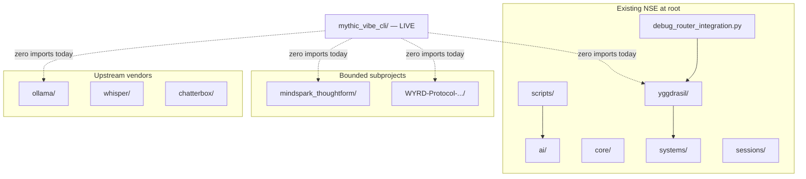
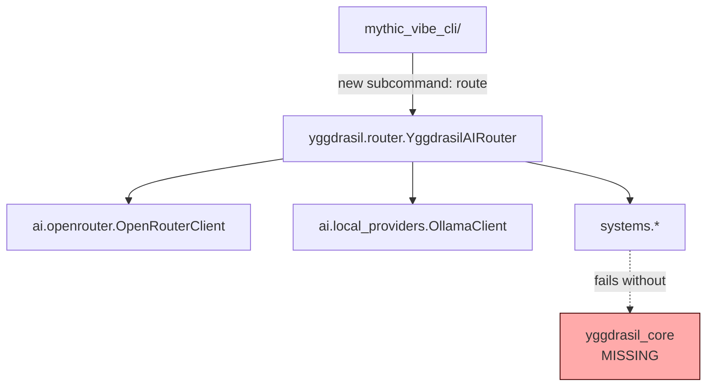
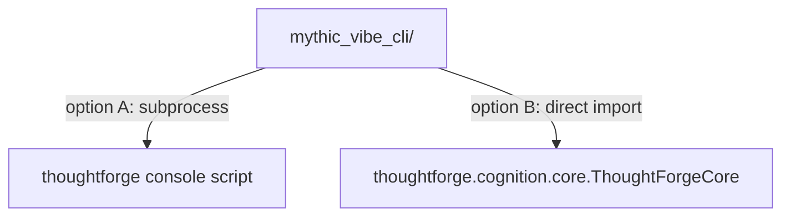
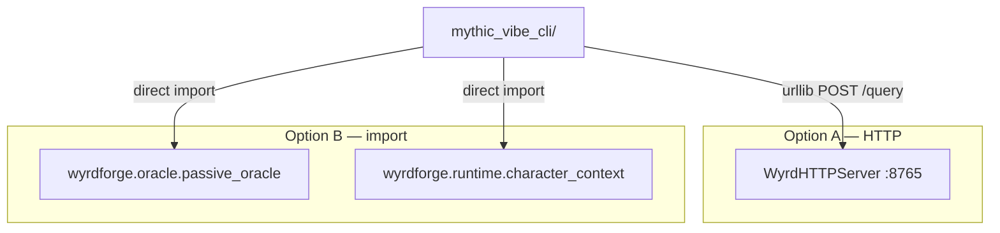
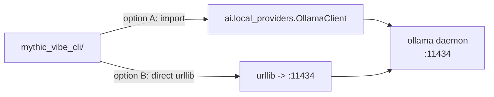
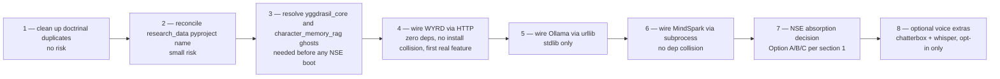

# IMPACT_integration.md — Integration-Readiness Map

**Last updated:** 2026-04-23
**Author:** Védis Eikleið (Cartographer)
**Scope:** Per-subproject assessment of current connection state to `mythic_vibe_cli/`, what an integration would touch, blast radius, and the recommended entry point.
**Companion scrolls:** `MAP.md`, `ARCHITECTURE.md`, `DEPENDENCIES.md`, `DATA_FLOW.md`, `YGGDRASIL_COMPARISON.md`, `DUPLICATES.md`.

## Symbol legend

- `→` verified import edge
- `⇢` conceptual / documentary reference only
- `[LIVE]` currently executing
- `[DORMANT]` present but not wired
- `[GHOST]` referenced by code but missing from repo

---

## 0. The integration terrain, at a glance

All five integration seams are currently **unwired**. One ghost bridge (`debug_router_integration.py`) exists but is a smoke-test, not a runtime integration. This document maps what each seam would require.

---

## 1. Seam: CLI ↔ NSE-at-root (Yggdrasil, systems, core, ai)

### Current connection state

`[DORMANT + GHOST IMPORTS]`

- CLI imports from NSE: **zero** (verified by grep — no `yggdrasil`, `wyrdforge`, `thoughtforge`, `systems`, `core`, `ai` references inside `mythic_vibe_cli/`).
- Only connective artifact: `debug_router_integration.py` at repo root inserts `sys.path[0] = repo_root` and tries to import `yggdrasil.router`, `yggdrasil.integration.norse_saga`, `yggdrasil.config`, `yggdrasil.ravens`. It is a standalone smoke-test script; the CLI does not invoke it.
- Another connective artifact: `scripts/parse_arxiv_and_generate.py` does the same `sys.path` trick and imports `ai.openrouter.OpenRouterClient`. Lives in `scripts/`, not wired to the CLI.
- **Two ghost imports block the NSE side from booting as-is:**
  - `core/emotional.py` → `from yggdrasil_core import tree` (✗ missing package)
  - `core/dream_system.py` → `from ..yggdrasil_core import tree` (✗ broken relative)
  - `core/saga_odin_rag.py` → same ghost
  - `systems/unified_memory_facade.py` → `from systems.character_memory_rag import ...` (✗ `character_memory_rag.py` not present)

### What integration would touch

- `mythic_vibe_cli/cli.py` gains a new subcommand (e.g. `mythic route <prompt>`).
- `mythic_vibe_cli/` gains a provider layer or imports `ai.openrouter` / `ai.local_providers` directly.
- `pyproject.toml` either grows dependencies (`httpx`, `numpy`, `pyyaml`, `requests`) or adds an optional-extras block `mythic-vibe-cli[nse]`.
- **Prerequisite:** reconcile the ghost imports — either provide `yggdrasil_core/tree.py`, or rewrite the broken imports to point at `yggdrasil.core.world_tree` / similar.
- **Prerequisite:** provide `systems/character_memory_rag.py` or remove the import from `systems/unified_memory_facade.py`.
- **Prerequisite:** decide whether NSE modules live at repo root (unpackaged) or move under `mythic_vibe_cli/engine/` with imports rewritten.

### Blast radius if merged

| Area | Effect |
|---|---|
| `pyproject.toml` | Goes from 0 deps to many (httpx, numpy, pyyaml, +optional) |
| `sys.path` discipline | NSE modules assume repo root on path — conflicts with installed-CLI usage |
| CLI test suite | `tests/` is tiny; NSE modules have no co-located tests here |
| Doc corpus | `config.yaml` at root is NSE v8.0.0 — would become live config, not reference-only |
| Ghost import reckoning | `yggdrasil_core` + `character_memory_rag` must be resolved first |

Blast radius: **large** — every CLI installation gains optional heavy deps, packaging has to absorb un-packaged NSE modules, and two ghost imports block the door.

### Recommended entry point

**Option A (gentle).** `mythic route` subcommand is a thin shell that `subprocess.run`s `python -m yggdrasil.router` or similar. Keeps the CLI package dependency-free. Needs a runnable entry module in `yggdrasil/`.

**Option B (absorbed).** Move `yggdrasil/`, `core/`, `systems/`, `sessions/`, `ai/` into `mythic_vibe_cli/engine/`; rewrite imports; add deps to pyproject. Largest work; tightest integration.

**Option C (skip for now).** Keep the NSE tree as a reference snapshot; do not integrate; wait until the CLI has a chat/orchestration feature that actually needs it.

**My mapping note:** Option C is the most honest present state — the CLI has not yet declared a need for an LLM router. Option A is the right first step when the need declares itself.

---

## 2. Seam: CLI ↔ MindSpark ThoughtForge

### Current connection state

`[DORMANT — self-contained]`

- CLI imports from MindSpark: **zero**.
- MindSpark lives at `mindspark_thoughtform/` with its **own** `pyproject.toml` (`name = "thoughtforge"`, v1.0.0, deps: `sqlalchemy`, `sentence-transformers`, `ijson`, `numpy>=1.26`, `tqdm`, `pyyaml`, `click`, `rich`, `platformdirs`).
- Declares its own console scripts: `thoughtforge`, `forge-memory`.
- 140 `from thoughtforge` occurrences — **all inside `mindspark_thoughtform/`**.
- Test suite runs in its own env (`mindspark_thoughtform/tests/`, ~620 tests per the user's memory).
- Nested `mindspark_thoughtform/MindSpark_ThoughtForge/` is a `[SHELL]` with only three MDs.

### What integration would touch

- Option A (**subprocess-based**): CLI invokes `thoughtforge` CLI as a child process; MindSpark must be `pip install -e mindspark_thoughtform/` first. Only `subprocess` and path hooks change in the CLI.
- Option B (**import-based**): CLI adds `thoughtforge` to its deps (direct or optional extra); imports `thoughtforge.cognition.core` directly; MindSpark becomes a required install.

### Blast radius if merged

| Area | Effect |
|---|---|
| Disk | MindSpark's data dir (`mindspark_thoughtform/data/`) is a rich Viking corpus — tens of MB of JSON/YAML. Already present; no growth from integration. |
| Deps | `sqlalchemy`, `sentence-transformers` pull in PyTorch transitively — heavy on install. |
| Tests | MindSpark's 620+ tests stay in their own suite. CLI tests do not run them. |
| numpy conflict | MindSpark requires `numpy>=1.26`; chatterbox pins `numpy<1.26` — see section 6. |

Blast radius: **medium** — import-based is heavy; subprocess-based is light.

### Recommended entry point

**Subprocess-based.** MindSpark is already a self-contained tool with its own CLI (`thoughtforge` console script). The cleanest wiring is: `mythic_vibe_cli/workflow.py` gains an optional "cognition enhancement" step that calls `thoughtforge ...` if installed; otherwise it is a no-op. Keeps the two projects decoupled and lets MindSpark keep evolving independently.

---

## 3. Seam: CLI ↔ WYRD Protocol

### Current connection state

`[DORMANT — self-contained, HTTP-ready]`

- CLI imports from WYRD: **zero**.
- WYRD lives at `WYRD-Protocol-World-Yielding-Real-time-Data-AI-world-model/` with its own `pyproject.toml` (`name = "wyrdforge"`, v1.0.0, deps: `pydantic>=2.0`, `pyyaml>=6.0`).
- 324 `from wyrdforge` occurrences — **all inside WYRD's own tree**.
- Has a stdlib-only HTTP bridge: `wyrdforge.bridges.http_api.WyrdHTTPServer` — binds port 8765 and exposes `POST /query`, `GET /world`, `GET /facts`, `POST /event`, `GET /health`.
- Has an NSE bridge: `wyrdforge.bridges.nse_bridge.NSEWyrdBridge` that expects a live NSE `YggdrasilEngine` instance — not present in this repo (NSE-at-root has `yggdrasil/` but not `YggdrasilEngine` in the shape WYRD's bridge expects).
- **Important:** `research_data/pyproject.toml` also declares `name = "wyrdforge"` (v0.1.0) — would collide on install.

### What integration would touch

- Option A (**HTTP**, zero-dep): CLI uses `urllib` (already imported for GitHub) to POST to the WYRD HTTP server. **No new deps in the CLI pyproject.** User runs `python -m wyrdforge.bridges.http_api` in another terminal; CLI talks to `localhost:8765`.
- Option B (**import**, tighter): CLI adds `wyrdforge` + `pydantic` to deps. Calls `PassiveOracle` and `CharacterContext.build()` directly in-process.

### Blast radius if merged

| Area | Effect |
|---|---|
| Deps | HTTP: 0 new deps. Import: `pydantic>=2.0`, `pyyaml>=6.0` minimum. |
| Packaging collision | Installing both `WYRD-.../wyrdforge` (v1.0.0) and `research_data/wyrdforge` (v0.1.0) breaks — resolve by installing only the full WYRD. |
| Runtime | HTTP adds a separate process to manage. Import adds in-process overhead. |
| Persistence | WYRD creates SQLite DBs (e.g. `wyrd_nse.db`) — CLI users would see these appear. |

Blast radius: **small for HTTP, medium for import**. The WYRD team explicitly designed for out-of-process usage (stdlib HTTP server, no framework deps).

### Recommended entry point

**HTTP, via `wyrdforge.bridges.http_api.WyrdHTTPServer`.** Keeps the CLI's zero-dep ethos. Matches WYRD's published usage pattern. `mythic_vibe_cli` could gain a `mythic world query "<who is at thornholt>"` that POSTs to `http://localhost:8765/query`.

---

## 4. Seam: CLI ↔ Ollama (vendored)

### Current connection state

`[DORMANT — vendored upstream, unused]`

- CLI imports from `ollama/`: **zero** (and could not, as `ollama/` is a Go project).
- `ai/local_providers.py` has an `OllamaClient` pointing at `http://localhost:11434` — the Ollama default port. **It is not imported by the CLI.**
- No other code in the repo invokes the vendored `ollama/`.

### What integration would touch

The vendored Go source in `ollama/` is not the daemon — the user is expected to run `ollama serve` from an installed binary. The vendoring is either for study or for eventual build-from-source; no code path in this repo builds or starts it.

### Blast radius if merged

| Area | Effect |
|---|---|
| Deps | Option A: pulls `ai/local_providers.py` (and its `httpx` / `requests` transitive dep) into CLI. Option B: stdlib `urllib` — zero deps. |
| Runtime assumption | User must have Ollama daemon running. Document clearly. |
| Vendored Go tree | Unused regardless — should probably not ship in CLI installs. |

Blast radius: **small** if direct urllib; **medium** if via `ai/local_providers.py` (brings in NSE dependencies).

### Recommended entry point

**Direct urllib first.** A `mythic complete --model llama3 --prompt "..."` could hit `POST http://localhost:11434/api/generate` with no deps. If model listing / health checks matter, promote to importing `ai.local_providers.OllamaClient`.

---

## 5. Seam: CLI ↔ Whisper (vendored)

### Current connection state

`[DORMANT — vendored upstream, unused]`

- CLI imports from `whisper/`: **zero**.
- No Python code anywhere in the repo (outside `whisper/` itself) imports Whisper.

### What integration would touch

- CLI would gain a `mythic transcribe <audio>` subcommand.
- Would need to add `openai-whisper` (or equivalent PyPI package) and its heavy deps: `numba`, `numpy`, `torch`, `triton` (linux x86_64 only), `tiktoken`, `more-itertools`.
- Or: vendor runtime binding via the existing `whisper/` tree on `sys.path`, which still requires the transitive deps.

### Blast radius

| Area | Effect |
|---|---|
| Deps | Heavy — `torch` alone is ~2 GB install. Must be optional-extras. |
| Platform constraints | `triton` is linux-x86_64 only; chatterbox also pins `torch==2.6.0` — compatibility dance. |

Blast radius: **very large** if made mandatory; **small** if kept opt-in.

### Recommended entry point

**Optional extra only.** `pip install mythic-vibe-cli[voice-in]`. Voice features should never be required for core CLI use.

---

## 6. Seam: CLI ↔ Chatterbox (vendored)

### Current connection state

`[DORMANT — vendored upstream, unused]`

- CLI imports from `chatterbox/`: **zero**.

### What integration would touch

- CLI would gain `mythic speak <text>` / `mythic voice ...` subcommands.
- Requires `chatterbox-tts` PyPI or its dependencies directly: `torch==2.6.0`, `torchaudio==2.6.0`, `transformers==4.46.3`, `diffusers==0.29.0`, `librosa==0.11.0`, `numpy>=1.24,<1.26`, `gradio==5.44.1`, etc.

### Known dependency conflicts — critical

See section 8 for the matrix, but the key conflict:

- **chatterbox** pins `numpy>=1.24,<1.26`
- **mindspark (thoughtforge)** requires `numpy>=1.26`

These cannot be co-installed into the same Python env without downgrading one's constraint. The cleanest resolution is to keep chatterbox in a **separate venv** — the CLI would shell out to it rather than import it.

Blast radius: **very large if imported**, **small if subprocess**.

### Recommended entry point

**Subprocess only.** `mythic speak` invokes a chatterbox CLI (or a `python -m chatterbox.example_tts ...`) in a separate environment. Keeps CLI deps clean.

---

## 7. Seam: CLI ↔ imports/norsesaga/ — the `world_will` / `world_dreams` additions

### Current connection state

`[ORPHAN]` — `imports/norsesaga/systems/` contains three files:

- `event_dispatcher.py` — identical to `systems/event_dispatcher.py` (md5 verified)
- `world_dreams.py` — not present in `systems/`; unique to this path
- `world_will.py` — not present in `systems/`; unique to this path

Nothing in this repo imports from `imports/norsesaga/`. It is a staging area.

### What integration would touch

If these two additions ever matter for the NSE runtime:

- Copy or move `world_dreams.py` / `world_will.py` into `systems/`, resolving any internal references.
- Drop the duplicate `event_dispatcher.py`.
- Delete the now-empty `imports/norsesaga/` tree.

### Blast radius

**Trivial.** No consumer today.

### Recommended entry point

Drop this from the integration checklist until a concrete need for `world_dreams` / `world_will` surfaces.

---

## 8. Dependency conflict matrix

Aggregated from `mindspark_thoughtform/pyproject.toml`, `WYRD-Protocol-.../pyproject.toml`, `chatterbox/pyproject.toml`, `whisper/requirements.txt`, `research_data/pyproject.toml`, and root `pyproject.toml`.

### Shared packages + version constraints

| Package | CLI root | MindSpark | WYRD | Chatterbox | Whisper | Conflict? |
|---|---|---|---|---|---|---|
| `numpy` | — | `>=1.26` | — | `>=1.24,<1.26` | (via torch) | **YES** — chatterbox vs mindspark |
| `pyyaml` | — | `>=6.0` | `>=6.0` | — | — | — |
| `pydantic` | — | — | `>=2.0` | — | — | — |
| `sqlalchemy` | — | `>=2.0` | `>=2.0` (optional) | — | — | — |
| `sentence-transformers` | — | `>=2.7` | (optional) | — | — | — |
| `torch` | — | `>=2.2` (optional) | — | `==2.6.0` | (transitive) | **YES** — chatterbox pins exact 2.6.0 |
| `torchaudio` | — | — | — | `==2.6.0` | — | pinned — no consumer yet |
| `transformers` | — | — | — | `==4.46.3` | — | pinned — mindspark transitively via sentence-transformers may conflict |
| `tqdm` | — | `>=4.66` | — | — | (unpinned) | — |
| `click` | — | `>=8.1` | (optional) | — | — | — |
| `pytest` | — | `>=8.0` | `>=7.0` | — | — | compatible |
| `pytest-cov` | — | `>=5.0` | — | — | — | — |
| `ruff` | — | `>=0.4` | `>=0.4` | — | — | compatible |
| `mypy` | — | `>=1.9` | `>=1.9` | — | — | compatible |

### Name collisions at install time

| Package `name` | Declared by | Effect if both installed |
|---|---|---|
| `wyrdforge` | `WYRD-Protocol-.../pyproject.toml` (v1.0.0) | — |
| `wyrdforge` | `research_data/pyproject.toml` (v0.1.0) | **collision** — second install overwrites first, or resolver refuses |

### Python version constraints

| Scope | Requires |
|---|---|
| CLI root | `>=3.10` |
| MindSpark | `>=3.10` |
| WYRD | `>=3.10` |
| research_data | `>=3.11` (narrower!) |
| chatterbox | `>=3.10` |
| whisper | (via PyPI package, supports 3.8+) |

All compatible at 3.11+. Using 3.10 would break `research_data`'s declared minimum.

### Summary

**Hard blockers for a single-env install (of everything):**

1. `numpy` — chatterbox `<1.26` vs mindspark `>=1.26`. Must be separate envs, or chatterbox stays subprocess-only.
2. `wyrdforge` package name — collision between WYRD and research_data manifests. Only one can install; treat `research_data/pyproject.toml` as exploratory / deprecated.

**Soft tensions (workable but needs attention):**

3. `torch` — chatterbox pins `==2.6.0`; mindspark optional `>=2.2`. Usable together at 2.6.0 if MindSpark accepts.
4. `transformers` — chatterbox pins `==4.46.3`; sentence-transformers may want a newer. Usable at 4.46.3 if compatible.

---

## 9. Sequence recommendation — the path through

Rationale:

- Steps 1–2 cost nothing and remove confusion/collision.
- Step 3 must happen before any NSE code can execute — currently a blocker the CLI doesn't feel because it doesn't touch NSE.
- Steps 4–6 are all **zero-dep or minimal-dep** integrations that give the CLI meaningful superpowers without dragging in PyTorch or a 2 GB install.
- Step 7 is a real decision point — only undertake when a CLI feature demands NSE's cognitive router.
- Step 8 is always opt-in. Never required for the core CLI story.

---

## 10. What I am uncertain about (honest)

- **I have not read** the full contents of `yggdrasil/cognition/*.py`, `yggdrasil/core/*.py` beyond the class signatures. There may be additional ghost imports beyond `yggdrasil_core`.
- **I have not verified** whether `wyrdforge.bridges.nse_bridge.NSEWyrdBridge` actually works against the `yggdrasil/` in this repo — it expects a `YggdrasilEngine` interface that the first-pass reading does not confirm is present. It may be expecting a version of NSE not extracted here.
- **I have not inspected** MindSpark's own CLI (`thoughtforge` console script) to confirm it is idempotent / safe to subprocess. The MindSpark memory file says v1.2.0 is live with 620 tests — trusting that.
- **I have not read** the full `integrations/` tree under WYRD (Unity/Unreal/Godot/etc.) — they are downstream-of-bridge consumers and out of scope for the CLI's integration.
- **I have not checked** whether `ai/openrouter.py` declares its own `httpx` requirement or silently assumes it. If assumed, the NSE path has a latent install failure.

Future passes should close each of these gaps before any actual integration work begins.
