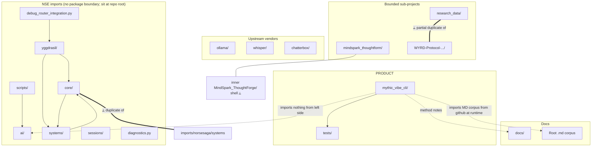

# MAP.md — Repo Top-Level System Map

**Last updated:** 2026-04-23
**Author:** Védis Eikleið (Cartographer)
**Scope:** Structural orientation for `Viking-Code-Mythic-Engineering-CLI-Vibe-Coding` on branch `development`.
**Companion scrolls:** `ARCHITECTURE.md`, `DEPENDENCIES.md`, `DATA_FLOW.md`; prose narrative in `INVENTORY.md` / `ORIGINS.md` (Scribe).

## Symbol legend

- `[PRODUCT]` — the declared deliverable of this repo
- `[IMPORT]` — vendored / copy-imported from another prior project
- `[UPSTREAM]` — third-party upstream project vendored wholesale
- `[DOCS]` — documentation or research material
- `[ORPHAN]` — root-level module with no visible caller inside this repo
- `→` — code-level dependency (imports, calls)
- `⇢` — documentary / conceptual dependency (reference-only, no import)
- `⟂` — duplicated / overlapping with another path here

---

## 1. Top-level ASCII tree (abridged)

```
Viking-Code-Mythic-Engineering-CLI-Vibe-Coding/
├── mythic_vibe_cli/                [PRODUCT]     6 py files — the actual CLI package
├── tests/                          [PRODUCT]     4 py files — only test the CLI
├── pyproject.toml                  [PRODUCT]     declares only mythic_vibe_cli as package
│
├── ai/                             [IMPORT-NSE]   openrouter.py, local_providers.py
├── core/                           [IMPORT-NSE]   yggdrasil.py, emotional.py, dream_system.py, ...
├── systems/                        [IMPORT-NSE]   27 files — the full NSE systems layer
├── sessions/                       [IMPORT-NSE]   memory_manager.py
├── yggdrasil/                      [IMPORT-NSE]   Nine-Worlds cognitive router + Ravens (huge)
├── diagnostics/                    [IMPORT-NSE]   turn_trace.jsonl (runtime artifact)
├── diagnostics.py                  [IMPORT-NSE]   NSE diagnostic utility (top-level)
├── debug_router_integration.py     [IMPORT-NSE]   imports yggdrasil.*
├── scripts/                        [IMPORT-NSE]   5 utility scripts, includes OpenRouter caller
│
├── imports/
│   └── norsesaga/systems/          [IMPORT-NSE]  ⟂ SMALLER copy of 3 files that also live in core/
│
├── mindspark_thoughtform/          [IMPORT-MindSpark]   full MindSpark ThoughtForge subproject
│   ├── src/thoughtforge/           full package: cognition, inference, knowledge, refinement, etl
│   ├── tests/                      phase1..phase8 test suite
│   └── MindSpark_ThoughtForge/     ⟂ empty shell (only PHILOSOPHY/README/RULES)
│
├── WYRD-Protocol-World-.../        [IMPORT-WYRD]   full WYRD v1.0.0 subproject
│   ├── src/wyrdforge/              ECS, oracle, bridges, persistence, runtime, llm, ...
│   ├── tests/                      30+ test files
│   └── integrations/, sdk/, tools/
│
├── research_data/                  [IMPORT-research_data]   25+ design MDs
│   └── src/wyrdforge/              ⟂ PARTIAL duplicate of WYRD wyrdforge (models/runtime/...)
│
├── ollama/                         [UPSTREAM]     vendored ollama/ollama Go project (681 Go files)
├── whisper/                        [UPSTREAM]     vendored openai/whisper Python package
├── chatterbox/                     [UPSTREAM]     vendored Resemble AI Chatterbox TTS
│
├── docs/                           [DOCS]        api/quickstart + research/ + specs/ (26 spec docs)
└── 40+ root .md files              [DOCS]        Mythic Engineering philosophy, codex, research
```

---

## 2. One-line role per major directory

| Path | Kind | Role |
|---|---|---|
| `mythic_vibe_cli/` | PRODUCT | The CLI. `mythic-vibe` / `mythic` console scripts. Argparse front-end + workflow + codex bridge + config. |
| `tests/` | PRODUCT | Unit tests for the CLI only (test_cli, test_config_and_bridge, test_workflow). |
| `pyproject.toml` | PRODUCT | Build config — only packages `mythic_vibe_cli`; everything else is unpackaged. |
| `ai/` | IMPORT-NSE | NSE AI-call clients (OpenRouter HTTP client, local Ollama/LM-Studio providers). |
| `core/` | IMPORT-NSE | NSE core services (yggdrasil tagger, emotional service, dream integrator, queue, RAG, ai_runtime_settings). |
| `systems/` | IMPORT-NSE | NSE subsystem layer — memory, rag, romance, stress, dice, religion, voice_bridge, 20+ others. |
| `sessions/` | IMPORT-NSE | NSE memory summariser. |
| `yggdrasil/` | IMPORT-NSE | NSE cognitive router — Nine-Worlds realms, Huginn/Muninn ravens, deep_integration, norse_saga integration. Heavy AI_HINTS sidecar docs (12 per module). |
| `diagnostics/` | IMPORT-NSE | Runtime trace log (data, not code). |
| `diagnostics.py` | IMPORT-NSE | Top-level NSE diagnostic harness. |
| `debug_router_integration.py` | IMPORT-NSE | Smoke test: imports `yggdrasil.router`, `yggdrasil.integration.norse_saga`, `yggdrasil.config`, `yggdrasil.ravens`. |
| `scripts/` | IMPORT-NSE | NSE utility scripts; `parse_arxiv_and_generate.py` → `ai/openrouter.py`. |
| `imports/norsesaga/systems/` | IMPORT-NSE | Thin 3-file copy (event_dispatcher, world_dreams, world_will) — ⟂ with `core/` / `systems/`. |
| `mindspark_thoughtform/` | IMPORT-MindSpark | Full MindSpark v1.0.0 subproject, self-contained (own pyproject, requirements, docker, tests). |
| `mindspark_thoughtform/MindSpark_ThoughtForge/` | ⟂ | Stub shell — only PHILOSOPHY.md, README.md, RULES.AI.md; code lives in sibling `src/thoughtforge/`. |
| `WYRD-Protocol-World-...-AI-world-model/` | IMPORT-WYRD | Full WYRD v1.0.0 subproject, self-contained (own TASK_*.md phase files, CLAUDE.md, 30+ test files, integrations, sdk, tools). |
| `research_data/` | IMPORT-research_data | 25 numbered research MDs + `src/wyrdforge/` partial duplicate + `wyrd_runtime/` packet docs. |
| `research_data/src/wyrdforge/` | ⟂ | Partial WYRD duplicate: models, runtime, schemas, security, services — overlaps with full WYRD src. |
| `ollama/` | UPSTREAM | Vendored ollama/ollama Go project — 681 Go files, complete server/runner/llm stack. |
| `whisper/` | UPSTREAM | Vendored openai/whisper speech-to-text. |
| `chatterbox/` | UPSTREAM | Vendored Resemble AI Chatterbox TTS/voice-conversion. |
| `docs/` | DOCS | `api.md`, `quickstart.md`, `specs/` (26 ThoughtForge/Sovereign RAG/Galdrabok specs), `research/data_project_development_resources/`. |
| Root `.md` files (40+) | DOCS | Mythic Engineering philosophy, RULES.AI, INSTRUCTIONS_FOR_AI, Codex, Emotional Engine plans, Fate-Weaver, Yggdrasil architecture guide, plus 178KB Emotional Engine theory, 177KB CHARACTER_TEMPLATE_SCHEM yaml. |
| Root JSON (arxiv_*.json, relevant_papers.json) | DATA | arXiv paper dumps consumed by `scripts/parse_arxiv_and_generate.py`. |

---

## 3. Relationship graph



**Legend:** solid → real import, dotted → documentary, `==⟂==` → duplication, `~~~` → no connection at all.

---

## 4. What talks to what — the load-bearing routes

1. **CLI island.** `mythic_vibe_cli.cli` is the entry point. It imports only its own siblings (`workflow`, `codex_bridge`, `config`, `mythic_data`) and stdlib. It does **not** import anything from `ai/`, `core/`, `systems/`, `yggdrasil/`, `mindspark_thoughtform/`, `WYRD-*/`, or any upstream.
2. **NSE island.** The repo-root NSE modules (`ai/`, `core/`, `systems/`, `sessions/`, `yggdrasil/`, `scripts/`, `debug_router_integration.py`, `diagnostics.py`) cross-import freely:
   - `yggdrasil.router_enhanced` → `systems.context_optimizer`, `yggdrasil.identity`.
   - `core.yggdrasil` → stdlib + numpy only.
   - `core.emotional` → `yggdrasil_core.tree` (package `yggdrasil_core` does **not exist** here — see Hidden thread H-1).
   - `core.dream_system` → `..yggdrasil_core` (broken relative — H-1 again).
   - `systems.emotional_engine` → local modules + `yaml`.
   - `scripts.parse_arxiv_and_generate` → `ai.openrouter`.
3. **MindSpark island.** Self-contained. Its `src/thoughtforge/` is the real package; its inner `MindSpark_ThoughtForge/` folder is a stub with only three markdown files.
4. **WYRD island.** Self-contained. `src/wyrdforge/` is complete. Own tests, own TASK_*.md phase files.
5. **research_data island.** Contains a **partial** `src/wyrdforge/` (models, runtime, schemas, security, services only) — a subset of WYRD's package. Whether this is an earlier snapshot or a shared-prefix copy is unresolved.
6. **Upstream islands.** `ollama/`, `whisper/`, `chatterbox/` are complete third-party trees — no edges in or out.
7. **Docs ↔ everything** — the root MD corpus and `docs/specs/` describe concepts the code either implements (WYRD, MindSpark) or aspires to (Yggdrasil cognitive architecture, Sovereign RAG, Fate-Weaver). These are ⇢ conceptual only.

---

## 5. Hidden threads

One-line each. Details belong in the integration task that follows exploration.

- **H-1 — `yggdrasil_core` is referenced but not present.** `core/emotional.py` does `from yggdrasil_core import tree`; `core/dream_system.py` does `from ..yggdrasil_core import tree`. Neither path resolves in this repo. These modules will fail to import as-is.
- **H-2 — Repo root is two packages pretending to be one.** `pyproject.toml` packages only `mythic_vibe_cli`, yet `ai/`, `core/`, `systems/`, `sessions/`, `yggdrasil/` sit at import root with NSE-style absolute imports (`from systems.event_dispatcher import ...`). If anyone runs the CLI from the repo root with `sys.path` including it, NSE modules become accidentally importable; if they run it installed, they do not. Silent coupling.
- **H-3 — Three copies of "wyrdforge".** `WYRD-.../src/wyrdforge/` (complete), `research_data/src/wyrdforge/` (partial — models/runtime/schemas/security/services), and the concept also appears described in MDs. Divergence risk if any is edited.
- **H-4 — `imports/norsesaga/systems/` is additive, not duplicative.** _(Revised 2026-04-23 on second pass.)_ Root `systems/` has **28** files including `event_dispatcher.py`. `imports/norsesaga/systems/` has three files, and only `event_dispatcher.py` is a byte-identical duplicate (md5 `8fd2f248...`). The other two — `world_dreams.py` and `world_will.py` — do **not** exist in root `systems/` at all; they are unique additions staged here. Recommendation label: `[IDENTICAL]` for `event_dispatcher.py`; the other two are `[ORPHAN-ADDITIONS]`. See `DUPLICATES.md` §4.
- **H-5 — MindSpark has an empty shell inside itself.** `mindspark_thoughtform/MindSpark_ThoughtForge/` holds only README/PHILOSOPHY/RULES — looks like a half-finished renaming or nested clone artifact.
- **H-6 — yggdrasil's 12-per-module sidecar MD explosion.** Every Python file in `yggdrasil/` (and many in its subtree) ships with 11–12 companion docs: `_AI_HINTS`, `_DEBUGGING`, `_DEPENDENCIES`, `_EXAMPLES`, `_INTERFACE`, `_METRICS`, `_PATTERNS`, `_PROMPTS`, `_README_AI`, `_TASKS`, `_TESTS`. This is an NSE agent-oriented doc scheme; it dwarfs the code by file count.
- **H-7 — `scripts/parse_arxiv_and_generate.py` is the only active bridge** between the NSE island and anything else in the repo: it inserts the repo root on `sys.path` and calls `ai.openrouter`. It expects `arxiv_results.json` at CWD — which exists at root as `arxiv_results.json` / `arxiv_all_papers.json` / `arxiv_papers.json` (three different arxiv dumps).
- **H-8 — Chatterbox + Whisper + Ollama have zero Python/Go-level edges into the rest of the repo.** They are present as source trees only. No code here imports from them. They sit as potential future integration surface.
- **H-9 — Tests pass or fail on three different rule-sets.** `tests/` (repo) tests only the CLI. `mindspark_thoughtform/tests/` expects its own pyproject env. `WYRD-.../tests/` expects wyrdforge install. No top-level test runner reconciles them.
- **H-10 — Documentation names drift.** "Mystic_Engineering_Protocals1.0.md" vs "Mythic_Engineering_CLI_Design_Ideas_*.md" vs "Mythic_Engineers_Codex.md" vs "MYTHIC_ENGINEERING.md" (generated). Typos and tense variations suggest multiple authors/generations compiled together without reconciliation.
- **H-11 — `config.yaml` at repo root is NSE v8.0.0 config, not Mythic Vibe CLI config.** The CLI uses `.mythic-vibe.json` layered precedence; the 35KB `config.yaml` documents OpenRouter models for the NSE. Reader confusion risk.
- **H-12 — `CHARACTER_TEMPLATE_SCHEM.yaml` is 177KB.** Large YAML at root with no visible code loading it in this repo; likely NSE/VGSK character schema data brought along for reference.
- **H-13 — Second ghost import: `systems.character_memory_rag`.** _(Added 2026-04-23 on second pass.)_ `systems/unified_memory_facade.py` line 42 does `from systems.character_memory_rag import CharacterMemoryRAG, create_memory_system`, but `systems/character_memory_rag.py` is not present in the repo. This is a second blocker alongside H-1's `yggdrasil_core` ghost. Any boot of the NSE memory layer will fail on this import. See `IMPACT_integration.md` §1.
- **H-14 — Two `pyproject.toml` files declare `name = "wyrdforge"`.** _(Added 2026-04-23.)_ Both `WYRD-Protocol-.../pyproject.toml` (v1.0.0) and `research_data/pyproject.toml` (v0.1.0) declare the same package name. Installing both into the same env collides. `research_data/src/wyrdforge/` additionally lacks `__init__.py` files, so it is not even an importable package — but the manifest still poses a latent install-time hazard. See `DUPLICATES.md` §3 and `IMPACT_integration.md` §3.
- **H-15 — wyrdforge duplication is a partial-plus-drift mix.** _(Added 2026-04-23.)_ `research_data/src/wyrdforge/` shares 5 of WYRD's 14 sub-packages. Among the shared files: some are byte-identical (`models/bond.py`, `models/memory.py`, `security/permission_guard.py`), while others have trivial 1-line drift (`services/bond_graph_service.py`, `services/memory_store.py`, `runtime/demo_seed.py`). Not a clean snapshot; small edits have accumulated on one side. See `DUPLICATES.md` §3.2.
- **H-16 — numpy constraint conflict.** _(Added 2026-04-23.)_ `chatterbox/pyproject.toml` pins `numpy>=1.24,<1.26`; `mindspark_thoughtform/pyproject.toml` requires `numpy>=1.26`. Cannot be co-installed in one environment. Forces chatterbox to stay subprocess-only if both are ever used together. See `IMPACT_integration.md` §6 and §8.
- **H-17 — `docs/specs/` at repo root is a verbatim copy of `mindspark_thoughtform/docs/specs/`.** _(Added 2026-04-23.)_ All 27 spec files (Algorithms, ThoughtForge guides, GALDRABOK preface, TurboQuant, Warding of Huginn's Well, etc.) are byte-identical across both locations. One of these two must be the source; the other is a lifted copy. See `DUPLICATES.md` §8.

---

## 6. Fastest route through the terrain

Read in this order to orient, then cross-check with `ARCHITECTURE.md` for layered view and `DATA_FLOW.md` for state movement:

1. `mythic_vibe_cli/cli.py` — 515 lines; defines every command. The entire product logic.
2. `mythic_vibe_cli/workflow.py` — templates + phase state machine.
3. `mythic_vibe_cli/codex_bridge.py` — how Codex packets are built.
4. `README.md` (root) — user-facing story of the CLI.
5. Then open the imported islands one at a time (MindSpark, WYRD, NSE-at-root, ollama) only when integration work begins.
