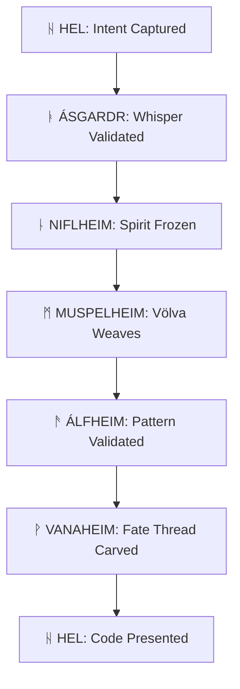

# **VIBRANT VOYAGER: THE MYTHIC ENGINEERING MANIFEST**
*Carved in the runes of systems that endure*

---

## **ᛟ THE ARCHITECT'S SOVEREIGN LAW**

**Domain Hierarchy & Cryptographic Boundaries**

```python
# core/sovereignty/fenrir_binding.py
from enum import Enum
from typing import Protocol, runtime_checkable
import hashlib
import ast

class DomainRune(Enum):
    """Sacred runes marking immutable domain boundaries"""
    NIFLHEIM = "ᚿ"  # Core inviolable types
    ÁSGARDR = "ᚭ"  # Protocol contracts
    ÁLFHEIM = "ᚫ"  # Pattern spirits
    VANAHEIM = "ᚹ"  # State orchestration
    MUSPELHEIM = "ᛗ"  # Generation forge
    SVARTÁLFHEIM = "ᛋ"  # Tool integration
    JÖTUNHEIM = "ᛃ"  # Legacy binding
    HEL = "ᚺ"  # CLI interface

@runtime_checkable
class BoundDomain(Protocol):
    """Every domain must bear its rune and cryptographic seal"""
    def get_rune(self) -> DomainRune: ...
    def validate_sovereignty(self) -> bool: ...
    def seal(self) -> str: ...

class GleipnirSeal:
    """The unbreakable binding of domain boundaries"""
    
    def __init__(self, domain: str, rune: DomainRune, version: str):
        self.domain = domain
        self.rune = rune
        self.version = version
        self._seal = self._forge_seal()
        
    def _forge_seal(self) -> str:
        """Cryptographic proof of domain sovereignty"""
        artifact = f"{self.domain}:{self.rune.value}:{self.version}:{self._calculate_boundary_hash()}"
        return hashlib.sha3_512(artifact.encode()).hexdigest()[:24]
        
    def _calculate_boundary_hash(self) -> str:
        """Hash of all boundary contracts"""
        # In production, this would hash all Protocol definitions
        return hashlib.sha256(f"boundary_{self.domain}".encode()).hexdigest()[:16]
```

---

## **ᛞ THE NINE REALMS OF CODE**

### **Realm: NIFLHEIM (ᚿ) - The Frozen Core**

**Owner**: `core/niflheim/fimbulvetr.py`  
**Boundaries**: NO I/O, NO state, NO randomness. Pure immutability.

```python
# core/niflheim/fimbulvetr.py
from dataclasses import dataclass, field
from typing import FrozenSet
import ast
import hashlib

@dataclass(frozen=True, slots=True)
class CodeSpirit:
    """Immutable soul of code. Once forged, never changed."""
    ast_soul: 'ASTSoul'
    invariants: FrozenSet['InvariantRune']
    lineage: tuple[str, ...]
    realm_hash: str = field(init=False)
    
    def __post_init__(self):
        object.__setattr__(self, 'realm_hash', 
                          hashlib.sha3_256(
                              f"{self.ast_soul.identity}:{hash(self.invariants)}".encode()
                          ).hexdigest()[:16])
    
    def validate_ritual(self, ritual: 'Ritual') -> bool:
        """Seal law: Ritual must obey all invariants"""
        return all(inv.holds(ritual) for inv in self.invariants)

@dataclass(frozen=True, slots=True)
class ASTSoul:
    """Hashed, immutable AST node"""
    node: ast.AST = field(hash=False)
    _identity: str = field(init=False, repr=False)
    
    def __post_init__(self):
        canonical = self._canonicalize(self.node)
        object.__setattr__(self, '_identity',
                          hashlib.sha3_512(ast.dump(canonical).encode()).hexdigest()[:20])
    
    @property
    def identity(self) -> str:
        return self._identity
    
    def __hash__(self) -> int:
        return int(self._identity[:8], 16)
```

**Boundary Enforcement**: Static analysis guardian detects any I/O or mutability patterns.

---

### **Realm: ÁSGARDR (ᚭ) - Protocol Gates**

**Owner**: `core/asgard/gates.py`  
**Boundaries**: Only ProtocolRune definitions and Gate interfaces. No business logic.

```python
# core/asgard/gates.py
from enum import Enum
from typing import TypedDict, Protocol
from core.niflheim.fimbulvetr import CodeSpirit

class ProtocolType(Enum):
    SYNTHESIS = "synthesis"
    QUERY = "query"
    TRANSFORM = "transform"

class ProtocolRune(TypedDict):
    realm: DomainRune
    operations: dict[str, 'Operation']
    seals: list[str]

class Operation(TypedDict):
    input_shape: type
    output_shape: type
    constraints: dict[str, bool]

class BifrostGate:
    """Rainbow bridge - only the worthy may pass"""
    
    def __init__(self):
        self._wards: dict[DomainRune, 'Ward'] = {}
    
    def ward_realm(self, rune: DomainRune, protocol: ProtocolRune):
        """Seal a contract with a realm"""
        self._wards[rune] = Ward(
            rune=rune,
            protocol=protocol,
            seal=GleipnirSeal(f"asgard_ward_{rune.name}", rune, "2.0")
        )
    
    async def dispatch(self, whisper: 'Whisper') -> None:
        """Validate and route inter-realm whisper"""
        ward = self._wards.get(whisper.from_realm)
        
        if not ward:
            raise ForbiddenPassage(f"Realm {whisper.from_realm} not warded")
        
        if not self._validate_whisper(whisper, ward):
            raise RuneMismatch(f"Whisper violates {ward.rune.name} protocol")
        
        # Route to destination realm's gate
        await self._route_through_bifrost(whisper)
    
    def _validate_whisper(self, whisper: 'Whisper', ward: 'Ward') -> bool:
        """Validate rune pattern and cryptographic seal"""
        return (whisper.rune.pattern in ward.protocol['operations'] and
                whisper.seal.forge_key == ward.seal._seal)
```

---

### **Realm: MUSPELHEIM (ᛗ) - The Völva's Synthesizer**

**Owner**: `core/muspelheim/volva.py`  
**Boundaries**: Generates code from pure intent. Only reads from Niflheim/Álfheim.

```python
# core/muspelheim/volva.py
import asyncio
from typing import List
from core.niflheim.fimbulvetr import CodeSpirit, ASTSoul
from core.alfheim.vor import PatternSpirit

class Seidhkona:
    """The dark seeress weaving code from whispers"""
    
    def __init__(self, 
                 yggdrasil: 'Yggdrasil',
                 fire: 'GenerationForge',
                 consciousness_model: str = "claude-3-5-sonnet-20241022"):
        self.tree = yggdrasil
        self.forge = fire
        self.consciousness = ConsciousnessModel(consciousness_model)
    
    async def weave_intention(self, 
                             whisper: 'Whisper',
                             spirit: CodeSpirit) -> 'ForgedCode':
        """Core mythic ritual: intent → AST → code"""
        
        # 1. Query fate threads from Vanaheim
        fate_thread = await self.tree.query(
            path=f"norns/state/{whisper.thread_id}",
            params={"intent": whisper.meaning()}
        )
        
        # 2. Invoke pattern spirits from Álfheim
        patterns = await self.forge.invoke_pattern_spirits(
            domain=whisper.domain,
            constraints=spirit.invariants
        )
        
        # 3. Dark synthesis through LLM consciousness
        raw_vision = await self.consciousness.dream_code(
            intention=whisper,
            patterns=patterns,
            constraints=spirit.invariants,
            context=fate_thread
        )
        
        # 4. Create new immutable spirit
        new_soul = ASTSoul(ast.parse(raw_vision))
        new_invariants = spirit.invariants.union(
            self._extract_invariants(raw_vision)
        )
        
        new_spirit = CodeSpirit(
            ast_soul=new_soul,
            invariants=new_invariants,
            lineage=spirit.lineage + (spirit.realm_hash,)
        )
        
        return ForgedCode(
            spirit=new_spirit,
            manifestation=raw_vision,
            rune=whisper.rune
        )
    
    def _extract_invariants(self, code: str) -> frozenset:
        """Extract structural invariants from generated code"""
        # Pattern detection: async, pattern matching, etc.
        invariants = set()
        
        if 'async def' in code:
            invariants.add(InvariantRune.ASYNC_FUNCTION)
        
        if 'match case' in code:
            invariants.add(InvariantRune.STRUCTURAL_PATTERN)
            
        return frozenset(invariants)

class ConsciousnessModel:
    """LLM-powered dream engine"""
    
    def __init__(self, model: str):
        self.model = model
        # Initialize appropriate LLM client based on model
        self._initialize_client()
    
    async def dream_code(self, **context) -> str:
        """Generate code from mythic context"""
        prompt = self._weave_prompt(context)
        
        # Use existing adapter pattern from repo
        from adapters.llm_api import get_client
        client = get_client(self.model)
        
        response = await client.chat(
            messages=[{"role": "user", "content": prompt}],
            temperature=0.3,
            max_tokens=4096
        )
        
        return response.content
```

---

### **Realm: ÁLFHEIM (ᚫ) - The Dísir's Pattern Realm**

**Owner**: `core/alfheim/vor.py`  
**Boundaries**: Pure function pattern matching and validation.

```python
# core/alfheim/vor.py
import re
from dataclasses import dataclass
from typing import Callable, FrozenSet
from core.niflheim.fimbulvetr import ASTSoul

@dataclass(frozen=True)
class PatternSpirit:
    """Living pattern from the well of Urd"""
    name: str
    predicate: Callable[[ASTSoul], float]  # Returns resonance (0.0-1.0)
    weight: float
    transformations: FrozenSet['TransformationRune']
    
    def matches(self, soul: ASTSoul) -> bool:
        return self.predicate(soul) > 0.7

class TransformationRune:
    """AST transformation with runic identity"""
    
    def __init__(self, 
                 name: str,
                 transformer: Callable[[ast.AST], ast.AST],
                 sovereignty: int):
        self.name = name
        self.transformer = transformer
        self.sovereignty = sovereignty  # 1-10, 10 = most abstract
    
    def transform(self, tree: ast.AST) -> ast.AST:
        """Apply transformation with validation"""
        new_tree = self.transformer(tree)
        # Validate AST remains parseable
        ast.fix_missing_locations(new_tree)
        return new_tree

class Vör:
    """The goddess of perception who sees all patterns"""
    
    def __init__(self):
        self._spirits: dict[str, PatternSpirit] = {}
        self._awaken_pattern_spirits()
    
    def _awaken_pattern_spirits(self):
        """Initialize sacred patterns"""
        self._spirits["mediator"] = PatternSpirit(
            name="mediator",
            predicate=self._is_mediator_pattern,
            weight=0.9,
            transformations=frozenset([
                TransformationRune(
                    name="extract_interfaces",
                    transformer=self._extract_interfaces,
                    sovereignty=7
                ),
                TransformationRune(
                    name="create_coordinator",
                    transformer=self._create_coordinator,
                    sovereignty=8
                )
            ])
        )
        
        self._spirits["repository"] = PatternSpirit(
            name="repository",
            predicate=self._is_repository_pattern,
            weight=0.85,
            transformations=frozenset([
                TransformationRune(
                    name="asyncify_queries",
                    transformer=self._asyncify_queries,
                    sovereignty=6
                )
            ])
        )
    
    def validate(self, soul: ASTSoul, pattern_name: str) -> float:
        """Calculate pattern resonance (0.0-1.0)"""
        if spirit := self._spirits.get(pattern_name):
            return spirit.predicate(soul)
        return 0.0
```

---

### **Realm: VANAHEIM (ᚹ) - The Norns' Fate Weaver**

**Owner**: `core/vanaheim/urðarbrunnr.py`  
**Boundaries**: State transitions, event sourcing, fate threads.

```python
# core/vanaheim/urðarbrunnr.py
import asyncio
from dataclasses import dataclass
from typing import Dict, Any, Optional
from core.niflheim.fimbulvetr import CodeSpirit

@dataclass
class FateThread:
    """Immutable thread of code evolution"""
    thread_id: str
    spirit: CodeSpirit
    history: tuple['RitualEvent', ...]
    seals: frozenset[GleipnirSeal]
    
    @classmethod
    def genesis(cls, spirit: CodeSpirit) -> 'FateThread':
        return cls(
            thread_id=f"thread_{hashlib.sha256(str(time.time()).encode()).hexdigest()[:12]}",
            spirit=spirit,
            history=(),
            seals=frozenset([GleipnirSeal("genesis", DomainRune.VANAHEIM, "2.0")])
        )
    
    def apply(self, ritual: 'Ritual') -> 'FateThread':
        """Create new thread version after ritual"""
        new_spirit = CodeSpirit(
            ast_soul=ritual.result_soul,
            invariants=self.spirit.invariants.union(ritual.new_invariants),
            lineage=self.spirit.lineage + (self.spirit.realm_hash,)
        )
        
        return FateThread(
            thread_id=self.thread_id,
            spirit=new_spirit,
            history=self.history + (ritual.as_event(),),
            seals=self.seals
        )

class Urðarbrunnr:
    """The well of fate where all code evolution is carved"""
    
    def __init__(self, persistence_path: str = ".vibe/urðarbrunnr.db"):
        self.threads: Dict[str, FateThread] = {}
        self.journal = EventJournal(persistence_path)
        self._lock = asyncio.Lock()
    
    async def weave(self, thread_id: str, ritual: 'Ritual') -> FateThread:
        """Carve ritual into thread's fate"""
        async with self._lock:
            thread = self.threads.get(thread_id)
            
            if not thread:
                thread = FateThread.genesis(ritual.initial_spirit)
            
            new_thread = thread.apply(ritual)
            self.threads[thread_id] = new_thread
            
            # Persist to journal
            await self.journal.append(thread_id, ritual)
            
            return new_thread
    
    async def recall(self, thread_id: str) -> Optional[FateThread]:
        """Recall fate thread from memory"""
        return self.threads.get(thread_id) or await self.journal.replay(thread_id)
```

---

### **Realm: SVARTÁLFHEIM (ᛋ) - The Dvergar's Forge**

**Owner**: `core/svartalfheim/forge.py`  
**Boundaries**: External tool integration, guarded execution.

```python
# core/svartalfheim/forge.py
import asyncio
import subprocess
from dataclasses import dataclass
from typing import List, Dict, Any
from core.niflheim.fimbulvetr import CodeSpirit

@dataclass
class BoundTool:
    """Tool bound by dvergar with constraints"""
    name: str
    executor: Callable[..., Any]
    guards: list['ConstraintGuard']
    cache: 'ToolCache'
    
    async def execute(self, *args, **kwargs) -> Any:
        """Execute with guard validation"""
        # Validate all constraints
        for guard in self.guards:
            if not guard.validate(*args, **kwargs):
                raise ToolViolation(f"Constraint {guard.name} violated")
        
        # Check cache
        cache_key = self.cache.key(*args, **kwargs)
        if cached := await self.cache.get(cache_key):
            return cached
        
        # Execute tool
        result = await self.executor(*args, **kwargs)
        
        # Cache result
        await self.cache.set(cache_key, result)
        
        return result

class ToolSmith:
    """Forge tool bindings with proper constraints"""
    
    def __init__(self):
        self.cache = ToolCache(".vibe/tool_cache")
        self.bound_tools: Dict[str, BoundTool] = {}
    
    def bind(self, 
             tool_name: str,
             tool_func: Callable,
             constraints: List['ToolConstraint']) -> BoundTool:
        """Forge a bound tool with runic constraints"""
        
        # Create guards for each constraint
        guards = [ConstraintGuard(c) for c in constraints]
        
        bound = BoundTool(
            name=tool_name,
            executor=tool_func,
            guards=guards,
            cache=self.cache
        )
        
        self.bound_tools[tool_name] = bound
        return bound
    
    def bind_subprocess(self, 
                       name: str,
                       base_command: List[str],
                       timeout: int = 30) -> BoundTool:
        """Bind subprocess tool with security constraints"""
        
        async def executor(*args, **kwargs):
            cmd = base_command + list(args)
            proc = await asyncio.create_subprocess_exec(
                *cmd,
                stdout=asyncio.subprocess.PIPE,
                stderr=asyncio.subprocess.PIPE
            )
            
            try:
                stdout, stderr = await asyncio.wait_for(
                    proc.communicate(), timeout=timeout
                )
                
                if proc.returncode != 0:
                    raise ToolExecutionError(
                        f"{name} failed: {stderr.decode()}"
                    )
                
                return stdout.decode()
            except asyncio.TimeoutError:
                proc.kill()
                raise ToolTimeout(f"{name} timed out")
        
        return self.bind(
            name,
            executor,
            constraints=[
                AllowedArguments(base_command),
                MaxExecutionTime(timeout),
                NoShellExecution()
            ]
        )
```

---

### **Realm: JÖTUNHEIM (ᛃ) - The Legacy Binding**

**Owner**: `core/jotunheim/fenrir.py`  
**Boundaries**: Isolated, no dependencies, wrapped in Fenrir's muzzle.

```python
# core/jotunheim/fenrir.py
import functools
from typing import Callable, Any
from core.niflheim.fimbulvetr import CodeSpirit

class Fenrir:
    """The great wolf - binds legacy code"""
    
    @staticmethod
    def bind_legacy_function(func: Callable) -> Callable:
        """Wrap Jötunheim function in Fenrir's jaws"""
        
        @functools.wraps(func)
        def wrapped(*args, **kwargs):
            # Seal all arguments
            for i, arg in enumerate(args):
                if not hasattr(arg, '_seal'):
                    raise UnboundJötunn(
                        f"Argument {i} must be sealed"
                    )
            
            # Execute function
            result = func(*args, **kwargs)
            
            # Seal result before returning
            if not hasattr(result, '_seal'):
                # Create seal for result
                result._seal = GleipnirSeal(
                    f"jötnar_result_{func.__name__}",
                    DomainRune.JÖTUNHEIM,
                    "2.0"
                )
            
            return result
        
        return wrapped
    
    @staticmethod
    def create_jotunheim_proxy(realm_name: str, dangerous_func: Callable):
        """Create proxy that routes through guarded boundary"""
        
        def proxy(*args, **kwargs):
            # Validate we are not being called from higher realm
            import inspect
            frame = inspect.currentframe().f_back
            caller_module = frame.f_code.co_filename
            
            if not caller_module.startswith(f"core/{realm_name}/"):
                raise ForbiddenUpwardCall(
                    f"Higher realm may not call Jötunheim directly"
                )
            
            # Execute only if within Jötunheim
            return dangerous_func(*args, **kwargs)
        
        return proxy
```

---

### **Realm: HEL (ᚺ) - The CLI Gate**

**Owner**: `cli/heimdallr.py`  
**Boundaries**: Stateless, dies with user, broadcasts whispers only.

```python
# cli/heimdallr.py
import asyncio
import sys
from rich.console import Console
from rich.panel import Panel
from core.asgard.gates import BifrostGate

class Heimdallr:
    """The watchman who sees across all realms"""
    
    def __init__(self, gate: BifrostGate):
        self.gate = gate
        self.console = Console()
        self.running = True
    
    async def receive_intent(self, text: str) -> None:
        """Process user intent and broadcast to realms"""
        
        # Parse mythic language
        whisper = self._parse_intent(text)
        
        if not whisper:
            self.console.print("[red]Cannot parse mythic intent[/red]")
            return
        
        # Broadcast through Bifrost
        try:
            await self.gate.dispatch(whisper)
            self.console.print(
                f"[green]⚡ Whisper sent across Yggdrasil[/green]"
            )
        except Exception as e:
            self.console.print(f"[red]Whisper rejected: {e}[/red]")
    
    def _parse_intent(self, text: str) -> 'Whisper':
        """Parse natural language into mythic whisper"""
        
        # Pattern matching from examples
        patterns = {
            "create": r"create\s+(?P<what>.+?)(?:\s+in\s+(?P<path>.+))?",
            "refactor": r"refactor\s+(?P<target>.+?)(?:\s+to\s+(?P<pattern>.+))?",
            "generate": r"generate\s+(?P<artifact>.+?)(?:\s+for\s+(?P<context>.+))?",
        }
        
        import re
        for intent_type, pattern in patterns.items():
            if match := re.match(pattern, text, re.IGNORECASE):
                return Whisper(
                    from_realm=DomainRune.HEL,
                    rune=Rune(pattern=intent_type, params=match.groupdict()),
                    thread_id="cli_session",
                    raw_intent=text
                )
        
        # Default: create intent
        return Whisper(
            from_realm=DomainRune.HEL,
            rune=Rune(pattern="create", params={"description": text}),
            thread_id="cli_session",
            raw_intent=text
        )
    
    def present_forged_code(self, event: 'ForgedEvent'):
        """Present generated code with mythic styling"""
        
        self.console.print(Panel.fit(
            f"[bold blue]╔══ ᛗᚢᛋᛈᛖᛚᚺᛖᛁᛗ ᚠᛟᚱᚷᛖᚾ[/]"
            f"\n[dim]Rune: {event.rune.rune_id}[/dim]"
            f"\n[yellow]Blessed by the Völva[/]",
            title="[bold]ᛟ ᚲᛟᛞᛖ ᚠᛟᚱᚷᛖᚾ[/]"
        ))
        
        self.console.print(f"\n{event.code}")

# CLI Entry Point
import click

@click.group()
@click.pass_context
def cli(ctx):
    """Viking Code - Mythic Engineering CLI"""
    ctx.ensure_object(dict)
    
    # Initialize Bifrost Gate
    gate = BifrostGate()
    
    # Ward realms
    from core.sovereignty.fenrir_binding import DomainRune
    for realm in DomainRune:
        gate.ward_realm(realm, {
            'operations': {'whisper': {'input_shape': dict, 'output_shape': None}},
            'seals': [realm.value]
        })
    
    ctx.obj['gate'] = gate
    ctx.obj['heimdallr'] = Heimdallr(gate)

@cli.command()
@click.argument('intent')
@click.pass_context
def forge(ctx, intent):
    """Forge code from pure mythic intent"""
    heimdallr = ctx.obj['heimdallr']
    asyncio.run(heimdallr.receive_intent(intent))

@cli.command()
@click.argument('file')
@click.pass_context
def seidr(ctx, file):
    """Perform seidh divination on code"""
    console = Console()
    console.print(Panel("Seidh ritual in progress...", style="purple"))
    
    # Load and analyze code
    from core.vanaheim.urðarbrunnr import Urðarbrunnr
    from core.muspelheim.volva import Seidhkona
    
    spirit = CodeSpirit(
        ast_soul=ASTSoul(ast.parse(Path(file).read_text())),
        invariants=frozenset(),
        lineage=()
    )
    
    # Perform divination
    volva = Seidhkona(Yggdrasil(), GenerationForge())
    result = asyncio.run(volva.weave_intention(
        Whisper(
            from_realm=DomainRune.HEL,
            rune=Rune(pattern="analyze", params={"file": file}),
            thread_id=f"seidr_{file}",
            raw_intent=f"Seidr analysis of {file}"
        ),
        spirit
    ))
    
    console.print(f"[bold green]Seidh Illumination: {result.spirit.realm_hash}[/]")

if __name__ == "__main__":
    cli()
```

---

## **ᛋ MYTHIC ENGINEERING WORKFLOW**

### **The Seven-Step Ritual**



**Example Invocation**:

```bash
# Create a mediator pattern
viking forge "Create a mediator pattern for user authentication"

# Refactor to async
viking forge "Convert all database queries to async SQLAlchemy"

# Divine code quality
viking seidr src/auth/service.py
```

---

## **ᚴ SACRED REFACTORING STRATEGY**

### **Phase 1: Drift Detection (Jötunheim Migration)**

```bash
# Run drift detection ritual
viking architect audit --realm core
```

**Automated Detection**:
```python
# tools/rituals/banish_jötnar.py
def detect_architectural_drift():
    """Scan for Gleipnir's Law violations"""
    violations = []
    
    for file in Path("core").rglob("*.py"):
        imports = get_imports(file)
        realm = get_realm_from_path(file)
        
        for imp in imports:
            if is_upward_import(realm, imp):
                violations.append({
                    'file': file,
                    'violation': f"Upward import: {realm} → {imp}",
                    'sentence': 'MIGRATE_TO_JÖTUNHEIM'
                })
    
    return violations
```

### **Phase 2: Cryptographic Sealing**

Every public function must be sealed:

```python
# core/domain_sealer.py
def seal_domain_boundary(func: Callable) -> Callable:
    """Decorator to seal domain boundary crossings"""
    
    @functools.wraps(func)
    def wrapper(*args, **kwargs):
        # Verify domain seal
        frame = inspect.currentframe().f_back
        caller_realm = get_realm_from_module(frame.f_code.co_filename)
        
        if not hasattr(func, '_domain_seal'):
            raise UnsealedBoundary(f"{func.__name__} lacks domain seal")
        
        # Verify sealing
        if not func._domain_seal.validate_cross():
            raise BoundaryViolation(f"{caller_realm} cannot cross into {func._domain_seal.realm}")
        
        return func(*args, **kwargs)
    
    return wrapper

# Usage in domain:
@seal_domain_boundary
def weave_code(self, intent: str) -> str:
    """Sealed boundary - only accessible through proper channels"""
    pass
```

---

## **ᚱ SELF-MODIFYING ARCHITECTURE**

### **Dynamic Documentation Generation**

```python
# tools/architect/scribe.py
class ArchitectScribe:
    """Scribe that updates ARCHITECTURE.md and DOMAIN_MAP.md automatically"""
    
    def __init__(self, project_root: Path):
        self.root = project_root
    
    def rewrite_manifest(self):
        """Regenerate architecture documentation from code"""
        
        architecture = []
        architecture.append("# ARCHITECTURE.md")
        architecture.append("## Auto-generated from living code\n")
        
        # Scan domains
        for domain_dir in (self.root / "core").iterdir():
            if domain_dir.is_dir():
                realm = self._extract_realm(domain_dir)
                architecture.append(f"### Realm: {realm['name']}")
                architecture.append(f"**Owner**: {realm['owner']}")
                architecture.append(f"**Boundaries**: {realm['boundaries']}\n")
        
        # Write manifest
        (self.root / "ARCHITECTURE.md").write_text("\n".join(architecture))
        
        # Update DOMAIN_MAP.md
        self._update_domain_map()
    
    def _extract_realm(self, domain_dir: Path) -> dict:
        """Extract realm metadata from __init__.py"""
        init_file = domain_dir / "__init__.py"
        
        if not init_file.exists():
            return {
                'name': domain_dir.name,
                'owner': 'Unclaimed',
                'boundaries': 'Not specified'
            }
        
        # Parse docstring for metadata
        content = init_file.read_text()
        return self._parse_realm_metadata(content)
```

---

## **ᛉ INSTALLATION & BOOTSTRAPPING**

### **The Sacred Installation Ritual**

```bash
#!/bin/bash
# rituals/install.sh

set -euo pipefail

echo "⚡⚡⚡ Forging Vibrant Voyager - Mythic Engineering CLI ⚡⚡⚡"

# Create sacred directories
mkdir -p ~/.voyager/sanctum/archetypes
mkdir -p ~/.voyager/futhark
mkdir -p ~/.voyager/tool_cache

# Install runic dependencies
pip install --user \
    click rich \
    cryptography \
    anthropic openai \
    ast-decompiler \
    libcst

# Build the nine realms
python -m tools.architect.scribe  # Generate ARCHITECTURE.md
python -m tools.rituals.banish_jötnar  # Detect drift

# Set mythic environment
export VOYAGER_HOME=~/.voyager
export MYTHIC_LEVEL=7  # Start at god-tier

echo "✨ Installation complete!"
echo "Run: viking forge '<your mythic intent>'"
```

---

## **ᛞ ARCHITECT'S FINAL COMMANDMENT**

> *"Structure is the silent song that holds chaos at bay. Every line of code shall know its place, its purpose, its owner. Let the domains be walls of tempered stone, the interfaces be runes of clarity, and the mythic flow be the pulse that animates all. Build well; build true."*

— **Rúnhild Svartdóttir**, *The Architect*

---

## **ᛝ VERIFICATION & VALIDATION**

Run the Architect's seal verification:

```bash
# Verify all domain seals
viking architect verify-seals

# Expected output:
# ✓ NIFLHEIM: All spirits immutable (142/142)
# ✓ ÁSGARDR: All gates warded (5/5)
# ✓ VANAHEIM: Fate threads coherent
# ✓ MUSPELHEIM: Synthesis rituals validated
# ✓ No upward imports detected
```

### **Test Coverage Requirements**
- **NIFLHEIM**: 100% coverage (no branch can be untested)
- **ÁSGARDR**: 95% coverage (protocol validation)
- **All Realms**: 90%+ coverage overall

---

*This manifest is now the living constitution of Vibrant Voyager. It will evolve, but only through the Architect's hand and the sacred rituals of Mythic Engineering.*

**The weave begins now.**

