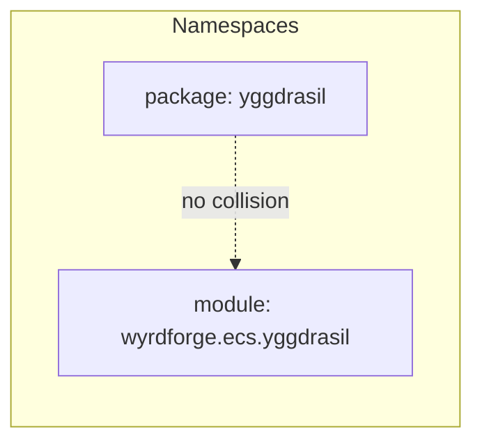

# YGGDRASIL_COMPARISON.md — The Two Yggdrasils, Side by Side

**Last updated:** 2026-04-23
**Author:** Védis Eikleið (Cartographer)
**Scope:** Structural comparison of the two `yggdrasil` code bodies present in `Viking-Code-Mythic-Engineering-CLI-Vibe-Coding`.
**Companion scrolls:** `MAP.md`, `ARCHITECTURE.md`, `DEPENDENCIES.md`, `DATA_FLOW.md`, `IMPACT_integration.md`, `DUPLICATES.md`.

## Symbol legend

- `→` import edge verified by grep
- `⇢` conceptual / documentary reference only
- `⟂` overlaps-in-name with the other tree
- `[NSE]` — Norse Saga Engine heritage
- `[WYRD]` — WYRD Protocol heritage

---

## 1. The two trees, named plainly

| Label | Path | Package name | Heritage | Role, in one line |
|---|---|---|---|---|
| **Yggdrasil-NSE** | `yggdrasil/` (repo root) | `yggdrasil` | [NSE] | Nine-Worlds cognitive router + two Ravens — every AI call flows through `yggdrasil.router` |
| **Yggdrasil-WYRD** | `WYRD-Protocol-.../src/wyrdforge/ecs/yggdrasil.py` (single file) | `wyrdforge.ecs.yggdrasil` | [WYRD] | ECS spatial-hierarchy service — Zone → Region → Location → Sub-location |

They share a name and a mythic aesthetic; they do **not** overlap in behaviour, shape, or call-site.

---

## 2. What each is actually for

### Yggdrasil-NSE — cognitive router (the Big Tree)

From `yggdrasil/router.py` header, verbatim:

> *"This is the ONLY entry point for AI calls in the Norse Saga Engine. No AI system is to bypass Yggdrasil or the Ravens."*

Its remit:

- **Nine realms** — `worlds/asgard.py` ... `worlds/helheim.py` — one Python module per mythic realm; each realm embodies a cognitive-task persona (planning, harmony, illusion/routing, manifestation, raw execution, forging, verification, critique, memory).
- **Two ravens** — `ravens/huginn.py` (query/retrieval) and `ravens/muninn.py` (persistent memory/archive), plus `ravens/raven_rag.py`.
- **Core kernel** — `core/world_tree.py` (orchestrator), `core/bifrost.py` (realm-router), `core/dag.py` (task graph), `core/llm_queue.py`.
- **Integrations** — `integration/norse_saga.py`, `integration/deep_integration.py`.
- **Cognition** — `cognition/hierarchical_memory.py`, `cognition/huginn_advanced.py`, `cognition/memory_orchestrator.py`, `cognition/gap_analyzer.py`, `cognition/domain_crosslinker.py`, `cognition/contracts.py`.
- **Knowledge** — `knowledge/chart_intelligence.py`, `knowledge/graph_weaver.py`, `knowledge/web_search.py`.

Shape of use: you hand it an LLM callable and a prompt; it decorates, routes, logs, caches, and returns.

### Yggdrasil-WYRD — spatial hierarchy (the Little Tree)

From `WYRD.../src/wyrdforge/ecs/yggdrasil.py` docstring, verbatim:

> *"Manages the spatial hierarchy of the world. The Yggdrasil Hierarchy nests containers: Zone → Region → Location → Sub-location. ... The tree is not stored separately — it lives entirely in ECS components."*

Its remit:

- **One file**, 273 lines, one class `YggdrasilTree`.
- No LLM. No routing. No cognition. No ravens.
- Reads/writes ECS components (`NameComponent`, `ParentComponent`, `ContainerComponent`, `SpatialComponent`) in `wyrdforge.ecs.world.World`.
- Provides spatial navigation — `place_entity`, `move_entity`, `get_location_of`, `get_ancestors`, `get_co_located`, `find_by_name`.
- Used by `wyrdforge.oracle.passive_oracle` to resolve "who is where" in character context building.

Shape of use: a service bolted onto a `World` instance; answers spatial questions about game-world entities.

---

## 3. Public API surfaces — side by side

### Yggdrasil-NSE — what the package exposes

Exported from `yggdrasil/__init__.py`:

```python
from yggdrasil import (
    # Core
    WorldTree, YggdrasilOrchestrator,
    DAG, TaskNode,
    Bifrost, RealmRouter,
    LLMQueue,
    # Ravens
    Huginn, Muninn, RavenRAG,
    # Worlds
    Asgard, Vanaheim, Alfheim, Midgard, Jotunheim,
    Svartalfheim, Niflheim, Muspelheim, Helheim,
)
```

Plus the router layer (not in `__all__` but importable):

```python
from yggdrasil.router import YggdrasilAIRouter, create_yggdrasil_router
from yggdrasil.router_enhanced import AICallType, CharacterDataFeed, AICallContext
from yggdrasil.identity import validate_identity_isolation
```

Router methods (load-bearing):

```python
class YggdrasilAIRouter:
    def __init__(self, llm_callable, data_path=None, comprehensive_logger=None,
                 wyrd_system=None, enhanced_memory=None,
                 prompt_builder=None, yggdrasil_cognition=None): ...
    def prepare_character_data(self, ...): ...
    def prepare_context(self, ...): ...
    def route_call(self, ...): ...
    def generate_dialogue(self, ...): ...
    def generate_narration(self, ...): ...
    def generate_combat_narration(self, ...): ...
    def generate_turn_summary(self, ...): ...
    def route(self, ...): ...
```

WorldTree methods (`yggdrasil/core/world_tree.py`):

```python
class WorldTree:
    def process(self, ...): ...
    def query(self, query: str, **kwargs) -> str: ...
    def remember(self, ...): ...
    def recall(self, ...): ...
    def fly(self, query: str, **kwargs) -> Dict[str, Any]: ...
    def get_stats(self): ...
    def heal(self): ...
    def persist(self): ...
```

### Yggdrasil-WYRD — what the class exposes

```python
class YggdrasilTree:
    def __init__(self, world: World) -> None: ...

    # Node creation
    def create_zone(self, *, zone_id, name, description="") -> Entity: ...
    def create_region(self, *, region_id, name, description="",
                      parent_zone_id) -> Entity: ...
    def create_location(self, *, location_id, name, description="",
                        parent_region_id) -> Entity: ...
    def create_sublocation(self, *, sublocation_id, name, description="",
                           parent_location_id) -> Entity: ...

    # Placement / movement
    def place_entity(self, entity_id, *, location_id,
                     sublocation_id=None) -> None: ...
    def move_entity(self, entity_id, *, location_id,
                    sublocation_id=None) -> None: ...

    # Navigation
    def get_location_of(self, entity_id) -> str | None: ...
    def get_spatial_path(self, entity_id) -> list[str]: ...
    def get_children(self, container_entity_id) -> list[Entity]: ...
    def get_co_located(self, entity_id) -> list[Entity]: ...
    def get_ancestors(self, entity_id) -> list[Entity]: ...

    # Queries / description
    def find_by_name(self, name, *, case_sensitive=False) -> list[Entity]: ...
    def entities_at(self, location_id) -> list[Entity]: ...
    def describe_tree(self) -> str: ...
```

### Concept overlap — literally none

```
NSE Yggdrasil        concepts: llm_callable, realm, bifrost, raven, rag,
                               dialogue, narration, turn summary,
                               world_tree.process(query)
WYRD YggdrasilTree   concepts: entity_id, zone/region/location/sublocation,
                               container, spatial path, co-located
```

No method name is shared; no imported type is shared; neither file imports from the other's package.

---

## 4. Which one would the current CLI use?

```mermaid
graph TD
    CLI[mythic_vibe_cli/ — current state]
    NSE[Yggdrasil-NSE<br/>yggdrasil/]
    WYRD[Yggdrasil-WYRD<br/>wyrdforge.ecs.yggdrasil]

    CLI -. no imports today .-> NSE
    CLI -. no imports today .-> WYRD

    NSE -.at-root, importable if on sys.path.-> NSE
    WYRD -.inside WYRD-Protocol-*/; not installed.-> WYRD
```

**Neither, today.** The CLI is fully isolated (verified by grep: zero `yggdrasil` / `wyrdforge` / `thoughtforge` mentions in `mythic_vibe_cli/`).

**If integration were attempted next:**

| Purpose of the future CLI feature | Best-fit tree | Why |
|---|---|---|
| Route an LLM call through an orchestrator / scaffolded reasoning pipeline | **Yggdrasil-NSE** | It is literally an LLM router with nine realms and two ravens. Built for this. |
| Maintain a structured game-world (entities, places) the CLI can query | **Yggdrasil-WYRD** | It is the spatial hierarchy service. Built for this. |
| Inject "who is at this location" into a Codex prompt packet | **Yggdrasil-WYRD** | `get_co_located`, `entities_at`, `describe_tree`. |
| Add "route this query through the Asgard realm for planning" | **Yggdrasil-NSE** | `Bifrost.route` / `WorldTree.process`. |
| Add persistent project-level memory the LLM can recall | Either, but lean toward **MindSpark** (self-contained, test-covered) or **Muninn** (NSE raven) | Muninn writes to disk, stores structured memory nodes. MindSpark has a full sovereign-RAG stack. |

The current CLI's closest structural cousin is **Yggdrasil-NSE's router** — the CLI already has a "packet renderer" (`codex_bridge.py`) that is in concept a pre-router. But wiring to it would require:

1. Resolving the `yggdrasil_core` ghost (see `MAP.md` H-1).
2. Installing the NSE runtime layer into the CLI's packaging (or path-inserting at runtime, as `scripts/parse_arxiv_and_generate.py` already does).
3. Reconciling NSE's absolute imports (`from systems.context_optimizer import ...`) with the CLI's packaged layout.

---

## 5. Can they coexist?



**Yes. They live in different namespaces entirely:**

- Yggdrasil-NSE imports as `yggdrasil.*` (top-level package).
- Yggdrasil-WYRD imports as `wyrdforge.ecs.yggdrasil.YggdrasilTree` (nested inside `wyrdforge`).

No Python import would shadow the other. Both could be installed side by side without interference.

The **only collision risk** is documentary — a reader who sees "Yggdrasil" in any doc must pause and ask which one. The codex-level MD corpus does not always disambiguate; `Building the Yggdrasil Cognitive Architecture in Python_ A Step-by-Step Guide.md` is describing Yggdrasil-NSE, while `YGGDRASIL_MANIFESTO.md` is also the NSE side. WYRD's `CLAUDE.md` identifies its tree as "spatial hierarchy" unambiguously.

---

## 6. Verdict

| Question | Answer |
|---|---|
| Same concept? | No. Same name, totally different purpose. |
| Overlap in API? | None. |
| Overlap in import path? | None (`yggdrasil` vs `wyrdforge.ecs.yggdrasil`). |
| Does one supersede the other? | No. They solve orthogonal problems. |
| Can they coexist in one running process? | Yes, without any rename. |
| Which does the CLI use today? | Neither. |
| Which would a future CLI *orchestrator* use? | **Yggdrasil-NSE** for LLM routing. |
| Which would a future CLI *world-state* feature use? | **Yggdrasil-WYRD** for spatial queries. |
| Which is more complete / production-ready? | WYRD's tree is compact, tested, and at v1.0.0. NSE's tree is sprawling, documented, and partially broken at the `core/` edge (ghost imports — see `MAP.md` H-1). Per-subsystem readiness differs. |

**Recommendation label:** `[COEXIST]` — name collision only; keep both; document the disambiguation in any future integration README.

---

## 7. One-line integration pointer

If you ever want to plug both into the CLI, the cleanest sequence is:

1. Leave Yggdrasil-WYRD inside `wyrdforge` — do not lift.
2. Decide whether Yggdrasil-NSE lives at repo root or gets vendored under `mythic_vibe_cli/engine/yggdrasil/` with its imports rewritten.
3. The CLI talks to WYRD via `wyrdforge.bridges.http_api` (already stdlib-only) rather than by direct import, so the WYRD tree never has to become part of the CLI package.
4. The CLI talks to NSE Yggdrasil by direct import — which requires first resolving the `yggdrasil_core` ghost (H-1) and the `systems.character_memory_rag` ghost (see `DUPLICATES.md` and `IMPACT_integration.md`).
