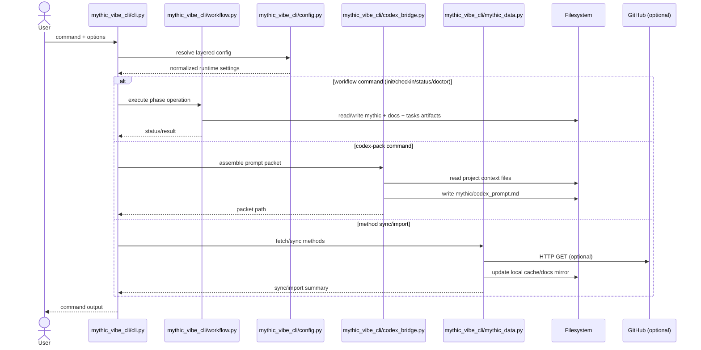

# DATA_FLOW

**Last updated:** 2026-04-23  
**Owner:** Architecture / Docs  
**Scope:** Practical data movement across the active product path (`mythic_vibe_cli/`) plus boundaries to dormant islands.

---

## 1) Executive route map

The only fully live end-to-end flow in this monorepo is the **Mythic Vibe CLI** path:

```text
User terminal input
  -> mythic_vibe_cli/cli.py command handlers
  -> mythic_vibe_cli/workflow.py orchestration
  -> project files (docs/, mythic/, tasks/)
  -> optional codex prompt packet (mythic/codex_prompt.md)
  -> human copy/paste to LLM
  -> CLI log/check-in writes back to status + devlog
```

Dormant runtime clusters (`ai/`, `core/`, `systems/`, `yggdrasil/`, `imports/norsesaga/`) and embedded islands (`mindspark_thoughtform/`, `WYRD-.../`, `ollama/`, `whisper/`) are currently **not** on the primary execution route.

---

## 2) Ingress points (where state enters)

| Ingress | Path | Type | Notes |
|---|---|---|---|
| CLI commands and flags | `mythic_vibe_cli/cli.py` | Human input | Primary runtime trigger surface (`imbue`, `checkin`, `status`, `doctor`, `codex-pack`, etc.). |
| Config files | `~/.mythic-vibe.json`, `$XDG_CONFIG_HOME/mythic-vibe/config.json`, `<project>/.mythic-vibe.json` | Disk JSON | Loaded and merged by `mythic_vibe_cli/config.py`. |
| Env overrides | `MYTHIC_EXCERPT_LIMIT`, `MYTHIC_PACKET_CHAR_BUDGET`, `MYTHIC_AUTO_COMPACT` | Process env | Highest-precedence config overrides. |
| Optional remote method source | GitHub raw/API endpoints | Network | Used by `mythic_vibe_cli/mythic_data.py` sync/import flows. |

---

## 3) Core transforms (where state is shaped)

### A. Workflow transforms (`mythic_vibe_cli/workflow.py`)

- Initializes project scaffolding and canonical working docs.
- Advances/records phase progress.
- Emits health/status summaries for operator feedback.

### B. Prompt-packet transforms (`mythic_vibe_cli/codex_bridge.py`)

- Reads context files (`tasks/current_GOALS.md`, `docs/ARCHITECTURE.md`, `mythic/plan.md`, `mythic/loop.md`, `mythic/status.json`).
- Applies safe excerpt truncation.
- Applies total packet budget compaction when configured.
- Renders a stable markdown packet for downstream LLM interaction.

### C. Config normalization (`mythic_vibe_cli/config.py`)

- Merges layered JSON config sources.
- Coerces numeric/boolean settings.
- Produces runtime-safe configuration consumed by CLI/bridge logic.

### D. Method sync/cache transforms (`mythic_vibe_cli/mythic_data.py`)

- Fetches/caches external method notes.
- Imports remote markdown trees into local docs mirrors.
- Falls back to local defaults when network retrieval fails.

---

## 4) Persistence map (where data rests)

| Store | Path | Owner | Lifecycle |
|---|---|---|---|
| Project status | `mythic/status.json` | Workflow/check-in commands | Mutable state over project life. |
| Project devlog | `docs/DEVLOG.md` | Check-in/log commands | Append-only chronological log. |
| Codex packet output | `mythic/codex_prompt.md` | `codex-pack` / `evoke` | Regenerated per request. |
| Initial project docs | `docs/*.md`, `tasks/current_GOALS.md`, `mythic/*.md` | `init/imbue` flow | Seeded once; then edited iteratively. |
| Plugin registry | `mythic/plugins.json` | Grimoire commands | Local registry for plugin entrypoints. |
| Local config | `mythic/config.toml` | Config commands | Per-project tool settings. |
| Local DB seed | `mythic/weave.db` | DB migration path | Local SQLite ritual store scaffold. |
| Method cache | `~/.mythic-vibe/method_cache.json` | Method sync layer | Cross-project user cache. |

---

## 5) Egress points (where data leaves)

| Egress | Channel | Producer | Purpose |
|---|---|---|---|
| Terminal summaries | stdout/stderr | CLI + workflow | Human operational visibility. |
| LLM prompt handoff | Human copy/paste | Codex packet | Bridges local context to external assistant. |
| Remote fetches | HTTPS (GitHub) | Method sync/import/plunder | Pulls upstream markdown/files into local workspace. |

---

## 6) Runtime sequence (active path)



---

## 7) Boundary conditions and non-flows

### Current hard reality

- Primary CLI runtime does **not** require direct imports from dormant runtime islands.
- Vendor trees and research corpora are mostly static/reference assets from the product flow perspective.

### Implication for contributors

If you introduce a cross-island dependency (for example, importing from `core/` or `yggdrasil/` into `mythic_vibe_cli/`), treat it as an architecture event and update:

- `docs/ARCHITECTURE.md`
- `docs/DOMAIN_MAP.md`
- `docs/DATA_FLOW.md` (this file)
- Root deep-dive records where relevant (`ARCHITECTURE.md`, `DEPENDENCIES.md`, `DATA_FLOW.md`)

---

## 8) Data-flow risks to watch

1. **Human bridge fragility:** the codex loop depends on manual copy/paste and may drift from intended packet contract.
2. **Config drift:** multiple config layers can mask unexpected overrides without explicit visibility.
3. **Doc/state divergence:** `status.json`, `DEVLOG.md`, and architecture docs can drift when check-ins are skipped.
4. **Silent coupling risk:** large dormant trees increase chance of accidental imports that alter blast radius.

---

## 9) Companion records

- `docs/ARCHITECTURE.md` — structural layers and execution boundaries.
- `docs/DOMAIN_MAP.md` — ownership and dependency law by domain.
- `ARCHITECTURE.md` / `DATA_FLOW.md` / `DEPENDENCIES.md` (root) — deep-dive system atlas artifacts.
