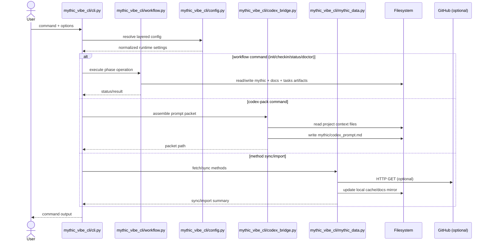

# DATA_FLOW

**Last updated:** 2026-05-03 (v1.0.0)
**Owner:** Architecture / Docs
**Scope:** Practical data movement across the active product path (`mythic_vibe_cli/`) plus boundaries to dormant islands.

---

## 1) Executive route map

The only fully live end-to-end flow in this monorepo is the **Mythic Vibe CLI** path:

```text
User terminal input
  -> mythic_vibe_cli/cli.py command handlers
  -> mythic_vibe_cli/workflow.py orchestration
  -> project files (docs/, mythic/, tasks/)
  -> optional codex prompt packet (mythic/codex_prompt.md)
  -> human copy/paste to LLM
  -> CLI log/check-in writes back to status + devlog
```

Dormant runtime clusters (`ai/`, `core/`, `systems/`, `yggdrasil/`, `imports/norsesaga/`) and embedded islands (`mindspark_thoughtform/`, `WYRD-.../`, `ollama/`, `whisper/`) are currently **not** on the primary execution route.

---

## 2) Ingress points (where state enters)

| Ingress | Path | Type | Notes |
|---|---|---|---|
| CLI commands and flags | `mythic_vibe_cli/cli.py` | Human input | Primary runtime trigger surface (`imbue`, `checkin`, `status`, `doctor`, `codex-pack`, `forge`, `provenance`, `persona`, `review`, etc.). |
| Config files | `~/.mythic-vibe.json`, `$XDG_CONFIG_HOME/mythic-vibe/config.json`, `<project>/.mythic-vibe.json` | Disk JSON | Loaded and merged by `mythic_vibe_cli/config.py`. |
| Env overrides | `MYTHIC_EXCERPT_LIMIT`, `MYTHIC_PACKET_CHAR_BUDGET`, `MYTHIC_AUTO_COMPACT`, `MYTHIC_RICH`, `MYTHIC_TIMING`, `MYTHIC_EVENT_LOG_LIMIT`, `MYTHIC_PLUGIN_TIMEOUT_SEC`, `MYTHIC_PLUGIN_BREAKER_THRESHOLD`, `MYTHIC_OTEL_ENABLED`, `MYTHIC_CHAT_BRIDGE_ENABLED`, `MYTHIC_VOICE_TTS_ENABLED`, `MYTHIC_ISLAND_<NAME>_ENABLED`, `MYTHIC_TUI_PANELS`, `MYTHIC_SNAPSHOT_UPDATE` | Process env | Highest-precedence config overrides. |
| Optional remote method source | GitHub raw/API endpoints | Network | Used by `mythic_vibe_cli/mythic_data.py` sync/import flows. |
| AI provider endpoints | Anthropic / OpenAI / Gemini / OpenRouter / Ollama HTTPS endpoints | Network | Used only when an `[ai]`-extra provider is selected and credentials are present. `copy-paste` provider uses no network. |
| Plugin manifest (read) | `mythic/plugins.json` | Disk JSON | Loaded by `PluginRegistry`. v1.0: includes optional `capabilities` array. |
| Persona file (read) | `mythic/persona.json` | Disk JSON | v1.0 / PH-20.A. Read-only when present; absent file == use built-in defaults. |
| Stdin (interactive surfaces) | `init --interactive`, `forge plan --interactive`, `mythic-vibe shell` | Process stdin | Wizard / approval-gate / REPL inputs. |
| Network surface inbound | `surfaces/web_terminal.py` (loopback default), `surfaces/chat_bridge.py` (Matrix / Telegram, gated by `MYTHIC_CHAT_BRIDGE_ENABLED`) | HTTP(S) / long-poll | Token-protected; see `docs/security/threat_model.md` §A4 / §A5. |

---

## 3) Core transforms (where state is shaped)

### A. Workflow transforms (`mythic_vibe_cli/workflow.py`)

- Initializes project scaffolding and canonical working docs.
- Advances/records phase progress.
- Emits health/status summaries for operator feedback.

### B. Prompt-packet transforms (`mythic_vibe_cli/codex_bridge.py`)

- Reads context files (`tasks/current_GOALS.md`, `docs/ARCHITECTURE.md`, `mythic/plan.md`, `mythic/loop.md`, `mythic/status.json`).
- Applies safe excerpt truncation.
- Applies total packet budget compaction when configured.
- Renders a stable markdown packet for downstream LLM interaction.

### C. Config normalization (`mythic_vibe_cli/config.py`)

- Merges layered JSON config sources.
- Coerces numeric/boolean settings.
- Produces runtime-safe configuration consumed by CLI/bridge logic.

### D. Method sync/cache transforms (`mythic_vibe_cli/mythic_data.py`)

- Fetches/caches external method notes.
- Imports remote markdown trees into local docs mirrors.
- Falls back to local defaults when network retrieval fails.

---

## 4) Persistence map (where data rests)

| Store | Path | Owner | Lifecycle |
|---|---|---|---|
| Project status | `mythic/status.json` | Workflow/check-in commands | Mutable state over project life. Schema-versioned via `core/state.py:CURRENT_STATE_SCHEMA_VERSION`; migrations in `persistence/migrations.py` (PH-19.4 hypothesis property tests cover the invariants). All writes via `runtime/atomic_write.py` + optional `runtime/cross_process_lock.py`. |
| Project devlog | `docs/DEVLOG.md` | Check-in/log commands | Append-only chronological log. |
| Codex packet output | `mythic/codex_prompt.md` | `codex-pack` / `evoke` | Regenerated per request. |
| Reusable packets | `mythic/packets/PKT-NNNNNN.{md,json}` + `.meta.json` | `packet create/ingest`, `workflow plan --packets` | Append-only artifact store. v1.0: `packet lint` audits without mutating. |
| Initial project docs | `docs/*.md`, `tasks/current_GOALS.md`, `mythic/*.md` | `init/imbue` flow | Seeded once; then edited iteratively. |
| **Project settings** (v1.0 / PH-20.0) | `mythic/project_settings.json` | `init --interactive` wizard | Operator-facing defaults from the wizard (project name, default provider, operator, scaffold preference). |
| **Persona file** (v1.0 / PH-20.A) | `mythic/persona.json` | `persona apply` | Opt-in operator preset (`solo` / `team-lead` / `auditor`). Refuses overwrite without `--force`. |
| **Forge ledger** (PH-03) | `mythic/forge/ledger.jsonl` | `forge run`, `forge resume` | Append-only per-step JSONL. Atomic-write + cross-process-lock protected. |
| **Forge reflections** (PH-03) | `mythic/reflections/REF-*.md` + `.json` | `forge run`, `forge resume` (auto), `forge reflection` | Per-workflow reflection artifact. |
| Verification artefacts | `mythic/verifications/VER-*.json` + `latest.json` | `verify --record` | Append-only per-run record; `latest.json` is a stable pointer. |
| Handoff artefacts | `mythic/handoffs/HND-*.{md,json}` | `handoff create`, `reflect` | Session-bridge records. |
| Check-in records (v1.0 / PH-02 slice 2.3) | `mythic/checkins/<iso-ts>-<phase>.md` | `intent`/`constraints`/`architecture`/`plan`/`build` capture commands | Phase-record artefacts. |
| **Governance review logs** (v1.0 / PH-20.H) | `mythic/governance/review-<YYYY-MM-DD>.md` | Operator (after running `review architecture`) | Operator-curated; `doctor --fix` will NEVER touch this directory. |
| **Status backups** | `mythic/backups/status.json.<stamp>.bak` | `migrate_project_state` (corrupt-recovery branch) | Auto-snapshot before fresh-state bootstrap when the migration encounters corrupt JSON. |
| Plunder manifest | `mythic/imports/plunder_manifest.json` | `plunder apply/record`; v1.0: `provenance verify`/`attest` reads it | Append-only; SHA + license + modifications per imported file. |
| Plugin registry | `mythic/plugins.json` | Grimoire/plugin commands | Versioned local registry for plugin entrypoints, hooks, enabled state, sandbox warnings. v1.0: optional `capabilities` array per record. |
| Local config | `mythic/config.toml` | Config commands | Per-project tool settings. |
| Local DB seed | `mythic/weave.db` | DB migration path | Local SQLite ritual store scaffold. |
| Method cache | `~/.mythic-vibe/method_cache.json` | Method sync layer | Cross-project user cache. |
| Method import corpus | `docs/mythic_source/*.md` + `mythic/method_manifest.json` | `import-md` | Cached upstream method markdown with SHA-256 manifest. |
| Bounded event log | `mythic/events.jsonl` | `runtime/event_log.py` (PluginHookDispatcher emits) | Capped at 200 entries; rotates by rewriting tail. TUI reads it for the Recent Events panel. |
| Knowledge graph | `mythic/graph.sqlite3` | `mythic-vibe scan`, `cmd_checkin` autopopulate | PH-05 SQLite memory; queried via `graph` subcommands. |
| AI provider call log | `mythic/ai/provider_calls.jsonl` | AI provider adapters | Append-only telemetry; `ai telemetry` reads it. |
| Conversation logs | `mythic/ai/conversations/CV-*.jsonl` | `ai run`, `ai ingest-response` | Per-conversation transcript. |
| **CycloneDX SBOM** (v1.0 / PH-19.5) | `docs/security/sbom.json` | Release pipeline (re-run `python scripts/regenerate_sbom.py`) | Source-controlled. Regenerated each release. Sanity-tested by `tests/test_sbom_committed.py`. |
| **JSON snapshot fixtures** (v1.0 / PH-19.1) | `tests/snapshots/*.json` | Bootstrap-on-first-run helper at `tests/_snapshot.py`; updated via `MYTHIC_SNAPSHOT_UPDATE=1` | Regression-fixed JSON contracts for high-value commands (e.g. `ai models`). |

---

## 5) Egress points (where data leaves)

| Egress | Channel | Producer | Purpose |
|---|---|---|---|
| Terminal summaries | stdout/stderr | CLI + workflow | Human operational visibility. `--json` reroutes via `runtime/output_guard.py` so accidental `print()` lands on stderr. |
| LLM prompt handoff | Human copy/paste | Codex packet | Bridges local context to external assistant. |
| Provider API calls (outbound) | HTTPS | `ai/providers/*.py` adapters; `forge run --provider <name>` | Only when an `[ai]`-extra provider is selected. Credentials redacted from logs via `security/redaction.py`. |
| Remote fetches | HTTPS (GitHub) | Method sync/import/plunder | Pulls upstream markdown/files into local workspace. |
| OpenTelemetry spans (v1.0 / opt-in) | OTLP HTTP | `protocols/` (PH-16); `MYTHIC_OTEL_ENABLED=1` gate | Optional structured-trace export. |
| Web terminal responses | HTTP (loopback by default) | `surfaces/web_terminal.py` | Token-protected; see `docs/security/threat_model.md` §A4. |
| Chat bridge messages | Matrix `/sync` / Telegram `getUpdates` long-poll | `surfaces/chat_bridge_loop.py` | Gated by `MYTHIC_CHAT_BRIDGE_ENABLED`; allowlist-filtered. |
| Release artefacts (v1.0 / PH-19.7) | GitHub Release attachments + PyPI uploads + auto-bump PRs | `.github/workflows/release.yml` | Triggered by `git push origin v*.*.*`. PyPI publish uses OIDC trusted publishing. |

---

## 6) Runtime sequence (active path)


```mermaid
sequenceDiagram
    actor U as User
    participant CLI as mythic_vibe_cli/cli.py
    participant WF as mythic_vibe_cli/workflow.py
    participant CFG as mythic_vibe_cli/config.py
    participant BR as mythic_vibe_cli/codex_bridge.py
    participant DATA as mythic_vibe_cli/mythic_data.py
    participant FS as Filesystem
    participant GH as GitHub (optional)

    U->>CLI: command + options
    CLI->>CFG: resolve layered config
    CFG-->>CLI: normalized runtime settings

    alt workflow command (init/checkin/status/doctor)
      CLI->>WF: execute phase operation
      WF->>FS: read/write mythic + docs + tasks artifacts
      WF-->>CLI: status/result
    else codex-pack command
      CLI->>BR: assemble prompt packet
      BR->>FS: read project context files
      BR->>FS: write mythic/codex_prompt.md
      BR-->>CLI: packet path
    else method sync/import
      CLI->>DATA: fetch/sync methods
      DATA->>GH: HTTP GET (optional)
      DATA->>FS: update local cache/docs mirror
      DATA-->>CLI: sync/import summary
    end

    CLI-->>U: command output
```

---

## 7) Boundary conditions and non-flows

### Current hard reality

- Primary CLI runtime does **not** require direct imports from dormant runtime islands.
- Vendor trees and research corpora are mostly static/reference assets from the product flow perspective.

### Implication for contributors

If you introduce a cross-island dependency (for example, importing from `core/` or `yggdrasil/` into `mythic_vibe_cli/`), treat it as an architecture event and update:

- `docs/ARCHITECTURE.md`
- `docs/DOMAIN_MAP.md`
- `docs/DATA_FLOW.md` (this file)
- Root deep-dive records where relevant (`ARCHITECTURE.md`, `DEPENDENCIES.md`, `DATA_FLOW.md`)

---

## 8) Data-flow risks to watch

1. **Human bridge fragility:** the codex loop depends on manual copy/paste and may drift from intended packet contract.
2. **Config drift:** multiple config layers can mask unexpected overrides without explicit visibility.
3. **Doc/state divergence:** `status.json`, `DEVLOG.md`, and architecture docs can drift when check-ins are skipped.
4. **Silent coupling risk:** large dormant trees increase chance of accidental imports that alter blast radius.

---

## 9) Companion records

- `docs/ARCHITECTURE.md` — structural layers and execution boundaries.
- `docs/DOMAIN_MAP.md` — ownership and dependency law by domain.
- `ARCHITECTURE.md` / `DATA_FLOW.md` / `DEPENDENCIES.md` (root) — deep-dive system atlas artifacts.
